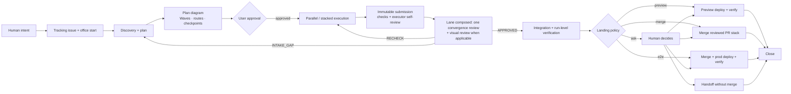
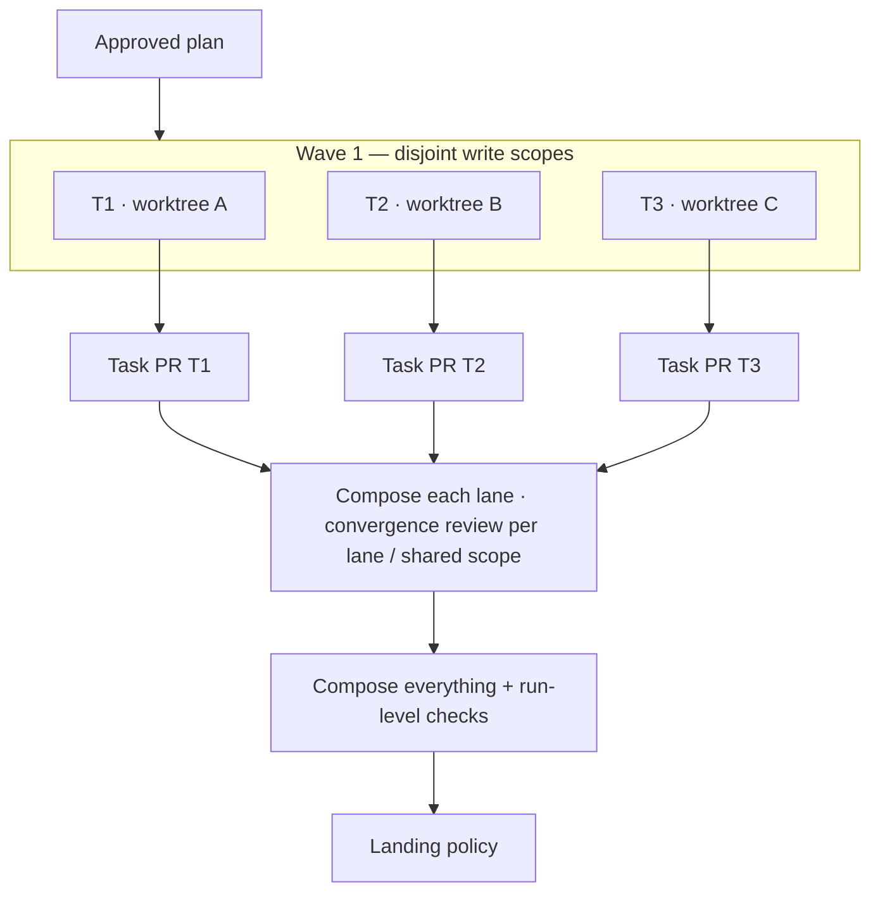
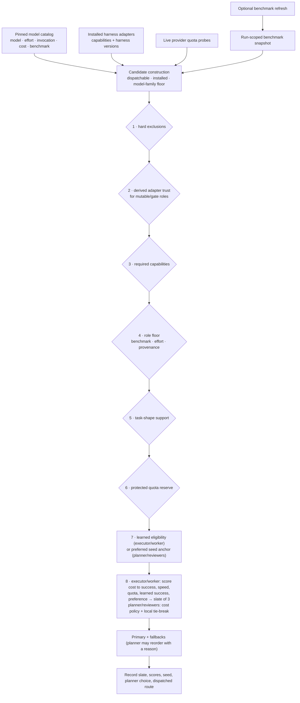

# Auto Office

> **Intent:** make agentic software development behave like a disciplined engineering team, not a single coding agent with a long prompt.

Auto Office is an **opinionated software-development lifecycle for AI agents**. One orchestrator owns strategy; specialist agents plan, implement, review, verify, and close out; the `office` runtime owns the mechanical state transitions that make those roles reliable.

The goal is simple: take a human intent and turn it into a reviewable, resumable, evidence-backed engineering run with explicit authority boundaries.

- **Distribution:** `auto-office`
- **Python package:** `office`
- **CLI:** `office`
- **State authority:** SQLite `runs.db` (WAL)
- **Core rule:** agents decide; the runtime records, isolates, routes, verifies, and resumes

Auto Office is deliberately not a generic multi-agent chat framework. It has a lifecycle, hard invariants, role-specific routing, isolated worktrees, immutable submissions, independent review, integration gates, version-pinned runs, and explicit landing authority.

**Start here:** [Install](#install) · [Opinionated SDLC](#the-opinionated-sdlc) · [Routing](#routing-different-roles-can-use-different-agents) · [Benchmarks](#benchmarks-intelligence-floors-without-online-routing) · [State & resume](#state-durability-and-resume) · [Development](#development)

## The lifecycle at a glance



**Figure 1 — Auto Office's opinionated SDLC.** Planning is a real phase, approval is a real state transition, review cannot be self-approved, and unavailable/stale/skipped evidence never becomes a pass.

## What Auto Office is trying to fix

Coding agents are good at producing code. Engineering systems need more than code production:

- a durable definition of what the user actually asked for;
- a plan whose parallelism and interfaces are visible before work starts;
- the right model/harness for each role instead of one model doing everything;
- isolation between concurrent writers;
- deterministic checks plus independent judgment;
- a bounded fix/review loop instead of endless agent conversation;
- integration verification after parallel work is composed;
- explicit human authority for requirement changes, irreversible actions, and merge-to-main;
- crash-safe state that survives a dead terminal, compacted context, or restarted agent.

Auto Office turns those into runtime behavior rather than hoping every agent remembers them.

---

## Install

### Install the skills as a plugin

This repo is a plugin marketplace for both Claude Code and Codex / ChatGPT. The plugin ships the skills only; you still need the CLI above.

```bash
# Claude Code
claude plugin marketplace add Hikari9/auto-office
claude plugin install auto-office@auto-office

# Codex / ChatGPT desktop
codex plugin marketplace add Hikari9/auto-office
```

Then enable `auto-office` from the Codex plugin directory. Claude reads `.claude-plugin/marketplace.json`; Codex reads `.agents/plugins/marketplace.json` and the root `plugin.json`. Keep `VERSION`, `plugin.json`, `.claude-plugin/*.json`, and `pyproject.toml` in sync; `scripts/check_ecosystem.py` enforces it.

### 1. Install the CLI

For normal use:

```bash
uv tool install auto-office
```

For browser capture and visual gates:

```bash
uv tool install 'auto-office[visual]'
```

The visual extra installs Playwright support and uses the local Chrome. Without it, a visual gate that requires capture reports `CAPTURE_BLOCKED`; it does not quietly pass.

### 2. Register the runtime and agent integrations

```bash
office install
office doctor
```

`office install` is idempotent. It registers the current runtime and installs the harness integrations that Auto Office can verify safely. Existing config is backed up before Office-managed entries are changed.

| Agent / harness | After `office install` |
|---|---|
| **Claude Code** | Installs managed `SessionStart`, `UserPromptSubmit`, and write-guard `PreToolUse` hooks in `~/.claude/settings.json`. |
| **Gemini CLI** | Installs managed `SessionStart`, `BeforeAgent`, and write-guard `BeforeTool` hooks in `~/.gemini/settings.json`. |
| **Codex** | No config is written; explicit `office` commands are the contract. |
| **agy / Antigravity** | No session-start hook is available; the agent uses explicit `office` commands/status. |
| **Hermes** | No automatic hook installation; use explicit `office` commands. |
| **Herdr** | When running inside Herdr, dispatches can open real agent panes and Office tracks/reclaims them. |

`office doctor` verifies the installed runtime, hook state, pinned runtimes, visual prerequisites, and known harness defects. If it reports `install: STALE`, reinstall the checkout rather than trusting the version string alone. `office doctor --fix` repairs Office-managed integration drift while preserving and backing up unrelated configuration.

> **For coding agents:** do not silently install or rewrite global harness configuration. If `office` is missing, ask the human before running `uv tool install ...` or `office install`; once installed, use the CLI contract below.

### 3. Give the agent one rule: follow `next:`

Every normal CLI result ends with a `next:` line. That is the runtime's declaration of the next legal action.

An agent operating Auto Office should:

1. run `office --version` and `office doctor` when bootstrapping a machine/session;
2. use `office start` or `office resume` rather than inventing lifecycle state;
3. follow `next:` instead of editing Office state directly;
4. never edit `runs.db`, generated run views, receipts, or telemetry by hand;
5. submit plans and implementation through `office submit`;
6. let the runtime dispatch reviewers and evaluate acceptance;
7. use `office inspect ...` or `--verbose` when it needs more detail.

`SKILL.md` is the orchestrator brief. Planner, executor, reviewer, and verifier briefs are generated by the runtime from the approved run state.

### Install from a checkout

For development:

```bash
uv tool install --editable .
# or
uv venv && uv pip install -e '.[visual,test]'
```

To put a checkout on your PATH as the installed runtime:

```bash
uv tool install --force --reinstall --no-cache "auto-office[visual] @ <checkout>"
office install
office doctor
```

Why `--reinstall --no-cache`? `uv` can otherwise reuse a cached wheel from an older commit with the same release number. `office doctor` should report that the install matches its source checkout and commit.

> **Cross-release note:** runs are pinned to their Auto Office MAJOR.MINOR line. A PATCH upgrade is served by the newest registered patch on that line. Crossing a MAJOR/MINOR is explicit with `office upgrade`; do not overwrite the runtime environment for active runs on an older line without pinning that runtime first.

### 4. Make the repository worktree-safe

Office creates fresh task, integration, and check worktrees. If your tests need dependencies, declare the setup command once in `.auto-office/config.yaml`; Office never guesses a package manager for you.

```yaml
worktree:
  setup: "uv sync --frozen"
  setup_inputs:
    - pyproject.toml
    - uv.lock
  setup_timeout_s: 600
  applies_to: [task, integration, check]
```

Use the equivalent command for your stack (`pnpm install --frozen-lockfile`, etc.). A new worktree runs the declared setup before agent/check work; reused worktrees rerun it when the setup command or watched inputs change.

---

## A 60-second run

A typical orchestrator flow looks like this:

```bash
# Create a run. The orchestrator has already created/reused the tracking issue.
office start "Add organization-scoped API tokens" \
  --issue 412 \
  --end-state ask

# If Office queued a dedicated planner, wait for it.
office wait

# Planner (or inline orchestrator) submits PLAN.md.
office submit

# Office prints the plan diagram. The user approves what was shown.
office approve plan --quote "Approved"

# Dispatch a parallel wave. Omitting --parallel stacks tasks instead.
office dispatch T1 T2 --parallel

# Act when work, findings, stalls, or decisions arrive.
office wait

# Once all tasks are accepted, compose + verify the integrated result.
office land

# For end-state=ask, choose merge/preview/e2e or hand off the ready PRs.
# Then close the run.
office close
```

`office close` is a cleanup sweep, not just a state change. After a real merge it fast-forwards the local base branch to `origin/<base>` (a dirty checkout of it is left alone and the user is asked), removes only the worktrees and `office/<run>/` branches Office created for the run (`git branch -d`, never `-D`), and runs `git worktree prune`. A `--handoff` close marks the PR ready and keeps everything for after the user merges. It warns (non-blocking) when the diff changes code but no CHANGELOG/README the repo keeps, and every path ends with one `office close done — <summary>` line.

The important part is not the exact command sequence above; it is that the runtime keeps the legal sequence explicit. If the state changes, `next:` changes with it.

## The opinionated SDLC

### 1. Intent becomes a durable run

The orchestrator starts from the human's outcome, creates or reuses one tracking GitHub issue, chooses the intended landing boundary (`ask`, `preview`, `merge`, or `e2e`), and runs `office start`.

`office start` pins the base revision, policy/config snapshot, catalog, Office version, risk inputs, and authority envelope. Unknown risk is not silently treated as low risk.

### 2. Planning happens before mutation

Depending on gear and risk, Office either queues a dedicated planner or permits inline planning. The planner performs repository reconnaissance, resolves interfaces and dependencies, and writes `.office/plans/<run>/PLAN.md`.

`office submit` turns that plan into a diagram containing:

- tasks and write scopes;
- parallel waves and stacked dependencies;
- route previews (`harness/model@effort`) with a reason;
- size classes and critical path;
- verification checkpoints;
- the landing chain.

That diagram is the last cheap place to notice accidental serialization, an unsafe route, a missing interface, or an unexpectedly expensive plan.

### 3. One approval authorizes one plan

Approval is a recorded state transition:

```bash
office approve plan --quote "<the user's exact words>"
```

A requirements change requires the user's words again. Ordinary decomposition/test/ordering amendments can be made by the orchestrator. Contract changes that alter scope, interfaces, ownership, or authority get stronger treatment and may wake the planner.

### 4. Execution is isolated

Each parallel task gets its own worktree and fenced scope. One mutable holder owns a write scope at a time.



**Figure 2 — Parallel work is isolated first, reviewed per lane, integrated once converged.** Task PRs may be stacked on their dependency's branch; the integrated tree is verified again because it is the first place all accepted work exists together.

### 5. Submission captures an immutable revision

`office submit` captures the executor's worktree exactly as it exists—including uncommitted edits—into an immutable revision. Replays are deduplicated. Files outside the task's declared scope are refused.

The runtime then evaluates the current revision through the gates funded by the run:

- deterministic task checks (the executor has already self-reviewed on four lenses, capped at 3 rounds);
- dependency/current-amendment checks;
- once every task of its lane is accepted, one independent convergence review of the composed lane, plus visual capture + visual review when the acceptance contract is user-visible;
- later, run-level integration checks.

There is no routine per-task independent code review under the current review contract.

### 6. Review converges; it does not rubber-stamp

New runs use the `convergence-v1` review contract ([`docs/review-convergence.md`](docs/review-convergence.md)). Plan, convergence, and visual reviews answer:

```text
APPROVED | RECHECK | INTAKE_GAP
```

- `APPROVED`: no blocking finding; the work advances now. Remaining findings must be fixed or dispositioned (`office disposition`) before landing, without another independent review.
- `RECHECK`: blocking findings. All of them route at once to the tasks that own them; repairs run in parallel, the lane recomposes, and the same reviewer reviews again.
- `INTAKE_GAP`: a missing or conflicting user-owned decision; the orchestrator asks the user at once.
- Severity (`high | medium | low`) is separate from blocking, and runtime status (`COMPLETED | UNAVAILABLE | EVIDENCE_BLOCKED | INVALID_RESULT`) is separate from both. An unavailable reviewer walks the fallback chain and never counts as a pass or a round.
- A repair that would move a hard seam (requirements, authority, ownership, dependency, interface, acceptance) is never APPROVED cleanup.

Review happens per ownership/composition **lane** (tasks joined by `depends` or a shared `lane:`), on the composed result, and once more per **shared scope** where lanes share a `converge:` name, an interface, a `shared:` registry, or changed files. Each RECHECK sequence stops after 3 substantive rounds; the user then chooses `escalate`, `continue`, `waive`, or `stop` (`office decide`). Required reviews are hard landing gates that only landing authority can waive, and the waiver keeps the underlying verdict on the receipt.

Each run is pinned to the review contract it started with. Runs started before #337 stay on the `v3.1` contract (`PASS | CHANGES_REQUIRED | PLAN_DEFECT | BRIEF_DEFECT | UNAVAILABLE`, per-task review, rolling plan review); `review.contract` in config picks the default for future runs only, and `office start --from-run <run>` moves old work onto the current contract as a new run.

### 7. Integration is a separate gate

Once every task is accepted and every lane and shared scope has converged, Office composes the accepted revisions in dependency order and runs the plan's run-level checks. Under `convergence-v1` there is no separate integration review: shared scopes already reviewed the cross-lane boundaries. (`v3.1` runs launch an integration reviewer at a real cross-task boundary, for example dependent/merging outputs or a shared interface.)

The integrated tree is the artifact that lands—not a collection of individually-green branches assumed to compose.

### 8. Landing follows explicit authority

The run's `end_state` decides how far Office is allowed to go:

| End state | Behavior |
|---|---|
| `ask` | Stop after accepted task PRs/integration and ask what to do. |
| `preview` | Deploy/verify the integrated result to preview only. |
| `merge` | Merge the reviewed PR stack after required checks. |
| `e2e` | Merge, deploy production, and verify. |

Merge-to-main remains a human authority boundary unless the user explicitly granted it for this run. External sends and unanticipated user-owned decisions also stop for the human.

---

## Routing: different roles can use different agents

Auto Office routes a **role**, not an entire run. A planner, executor, code reviewer, visual reviewer, and closeout verifier can all use different harness/model/effort triples.

Routing is constrained before it is optimized.



**Figure 3 — Routing and benchmarks.** Cost is deliberately late. A cheap route cannot undercut hard exclusions, derived trust, required capabilities, the role/benchmark floor, task-shape compatibility, or the protected quota reserve. For executors and workers (#300), cost is one weighted term, measured as expected cost to a successful task rather than token price, so a cheap route that needs many retries does not win by default.

### Default role policy examples

The shipped config currently expresses preferences such as:

| Role | Example preference / floor |
|---|---|
| Planner | Prefer `opus@medium`, then `astra@low`; requires planning capability and at least low effort. |
| Plan reviewer | Prefer `luna@xhigh`, then Claude `opus@low`; requires review capability and benchmark index score >= 31. |
| Executor | Requires builder capability and benchmark index score >= 31; selection is shaped by task evidence, quota, policy, and cost. |
| Code reviewer | Reviews each lane's composed result (per task on `v3.1` runs). Prefer `luna@xhigh`, then Claude `opus@low`; independent from the producer's model family; benchmark score >= 31. |
| Visual reviewer | Prefer agy `gemini-3.8-flash` routes, then Sonnet, then Luna; also requires a passing image-sensitive conformance proof for that exact route. |
| Closeout verifier | Requires verification capability and at least medium effort. |

These are policy defaults, not promises that a particular route will always be selected. Installed harnesses, trust evidence, task shape, model-family floors, live quota, benchmark availability, and explicit user overrides can all change the result.

### Example: automatic routing

```bash
office dispatch T2
```

At plan submit, the runtime builds candidates from the pinned catalog and installed adapters, applies the role gates, and ranks each task's qualifying executor routes into an Inline Slate in the plan diagram:

```text
T2  Implement mul                off base
    ROUTING
    PRIMARY     claude/claude-sonnet-5-5@high  best success/cost/speed fit
                + strong local evidence (86% success, n=90)   - quota unknown
    FALLBACK 1  codex/gpt-6-luna@high          cheaper to success than the primary (0.019 behind)
                + lowest expected cost to success   - little local evidence (n=7)
    FALLBACK 2  agy/gemini-3.8-flash@medium    faster than the primary (0.040 behind)
                + fastest expected completion   - quota unknown
```

`office dispatch T2` probes quota again and runs the primary, or the first fallback that still qualifies, saying why. When none does, it stops and `office dispatch T2 --reroute` routes from current evidence. The full evidence matrix and the audit record:

```bash
office inspect route T2          # slate, scores, seed, fallbacks taken
office inspect route T2 --json   # the complete audit record
office inspect learner           # what the router has learned from past runs
```

### Example: force a producer and reviewer

When the user names the route, that explicit choice outranks the automatic registry/trust/floor selection for the producer:

```bash
office dispatch T2 \
  --as agy/gemini-3.8-flash@medium \
  --review-as claude/sonnet@high
```

The runtime still records the override, resolves catalog aliases when possible, and enforces reviewer independence: the reviewer cannot share the producer's model family.

### Example: prepare a task for an externally started agent

```bash
office dispatch T2 --as codex/luna@xhigh --external
```

Office prepares the task worktree, lease, brief, and environment, but does not launch the agent. It prints the commands required to start the external/Herdr agent against that exact task contract.

### Routing policy layers

Normal config precedence is:

```text
prompt / CLI > repo config > user config > plugin defaults
```

The repo layer lives at `.auto-office/config.yaml`; user defaults live at `~/.config/auto-office/config.yaml`.

### Setting preferences: `office config` and `office setup`

`office config` edits those files like `git config`; `office setup` is the interactive version.

```bash
office setup                                   # prompts per role, then cost policy; --repo for this repository
office config roles.code_reviewer.preferred_seed claude/sonnet@high,codex/luna@xhigh
office config roles.code_reviewer.preferred_seed   # read the effective value
office config cost_policy.default quota_saver --repo
office config --list [--all] [--show-origin]   # what the files set (--all: every effective value)
office config --unset roles.code_reviewer.preferred_seed
office config --edit | --path                  # open in $EDITOR (validated afterwards) | print file paths
```

- Writes go to the user file by default and to `.auto-office/config.yaml` with `--repo`. Only the keys you set are written, never the shipped defaults.
- A `preferred_seed` takes the same `[harness/]model[@effort]` form as `office dispatch --as`, most preferred first. Any role can carry one, including `executor`, where it is one soft term in routing.
- Every edit is resolved and validated before it is written: unknown keys and models (with suggestions), efforts the model lacks, and invalid policy values are refused. `--force` sets a key the shipped config does not define.
- Rewriting drops YAML comments; a file that had any is copied to `<file>.bak` first.
- New runs pick the change up. A running run keeps the policy it pinned at `office start`.
- Preferences are soft: floors, trust, quota, and task shape still apply. To force a route for one task, use `office dispatch --as` / `--review-as`.

The shipped cost policies are `money_saver`, `quota_saver`, and `balanced`. The default is `balanced`, with a protected provider quota reserve. Cost only influences candidates that have already cleared the required gates. For executors and workers each policy is a weight set under `routing.adaptive.weights`, and `routing.adaptive.budget_ceiling_usd` is the one cost-based cut-off; `cost_policy.balanced_money_band_percent` now applies only to planner and reviewer routing.

---

## Benchmarks: intelligence floors without online routing

Some roles have an **intelligence floor**, not merely an effort floor. The shipped catalog carries version-pinned scores from the **Artificial Analysis Intelligence Index**. The current catalog index is:

```text
Artificial Analysis Intelligence Index v4.3.2
```

Raw scores from different index versions are not treated as comparable.

For example, executor and code-review routes currently require a score of at least 31 on that exact index version. A candidate with no score for the required index fails closed for that floor; Office does not invent or interpolate one.

### The shipped catalog is the normal path

Routing itself stays offline. `catalog/seed.yaml` contains the known model/harness/effort rows, invocation provenance, benchmark scores, and available cost metadata. Every run pins the catalog it started with.

### Optional one-shot refresh

Intake does not ask about this. The user opts in to filling **missing** benchmark scores for the current run by explicitly invoking the `auto-update-benchmarks` skill, which runs:

```bash
office benchmarks brief
```

Calling `brief` is the opt-in. `office start --benchmark-refresh` still records it up front.

`office benchmarks brief` writes a bounded brief for **one** low-cost background subagent. Office itself does not perform the web fetch; the refresher agent does, so route selection remains offline. That subagent fetches Artificial Analysis data and submits a delta:

```bash
office benchmarks submit <delta.yaml>
```

The refresh contract is intentionally strict:

- opt-in; off by default;
- at most one refresh per run;
- only the catalog's exact benchmark index version is accepted;
- only existing dispatchable catalog rows with a missing score are eligible;
- existing trusted scores are never replaced;
- scores must be copied from Artificial Analysis source pages, not inferred;
- the delta is accepted atomically or rejected atomically;
- an accepted delta becomes a **run-scoped snapshot** identified by its hash;
- routes decided after the refresh record that snapshot hash;
- routes already decided keep the snapshot/catalog they used.

This lets a long run learn that a newly cataloged route now satisfies an intelligence floor without turning routing into a live web dependency or mutating global truth mid-run.

---

## State, durability, and resume

`runs.db` is the lifecycle authority. JSON under a run directory is a generated view/evidence surface, not writable state.

A semantic transition and the outside work it requires are coupled transactionally: the transition writes an **outbox** row in the same SQLite transaction; short-lived `office _job` processes claim those rows and record their result. If the process dies after the state transition, the work is delayed—not forgotten.

That design enables:

- `office resume` after a terminal or agent restart;
- deduplicated submission/replay;
- durable review findings and waivers;
- versioned plan/requirements/routing amendments;
- recovery of queued jobs;
- exact auditability of which revision, route, and benchmark/catalog snapshot produced a verdict.

### Version-pinned runs

Every run is pinned to the Office release line that created it. The front door re-executes commands through the registered runtime for that line. A run never silently migrates because a different version of `office` appeared on PATH.

Use:

```bash
office list
office resume [run]
office upgrade [run] [--to X.Y]
office doctor
```

A cross-line upgrade is explicit and dry-runs by default.

Codex reviews keep the agent-written `reply.txt` separate from the CLI's final
chat message in `last-message.txt`. Headless reviews read the reply first and
use the final message only when the reply is absent or empty.

If a Codex Herdr launch fails, Office checks the pane for hook review, folder
trust, and update screens and names the blocking screen in its fallback notice.
Review or skip it in the named pane before the next launch. `office doctor`
warns when user, project, or enabled plugin hooks need a manual trust check;
it cannot verify Codex's hook hashes, and `--fix` never grants hook trust.

---

## Visual verification

Visual acceptance is separate from code review.

When acceptance names user-visible behavior, Office can capture deterministic browser evidence using the local Chrome: requested viewports/states, settled fonts, DOM measurements, and screenshots. Evidence is classified independently of judgment:

```text
COMPARABLE | INVALID_COMPARISON | NOT_APPLICABLE | CAPTURE_BLOCKED
```

A visual reviewer is eligible only after its exact harness/model/effort path passes an image-sensitive conformance probe. Code review and visual judgment are different dispatches. Under `convergence-v1` the visual review runs once per lane, on the same composed commit as the lane's convergence review.

Install the visual extra when you expect browser/UI work:

```bash
uv tool install 'auto-office[visual]'
office doctor --probe-vision
```

---

## Web UI

A local workstation over every Auto Office run on this machine: Issues, Agents, Allocation and Settings.

```bash
office web serve                  # foreground, http://127.0.0.1:8765/
office web start                  # background daemon; pid file under <state home>/web/
office web status                 # running?, URL and pid
office web stop
office web serve --fixture small  # demo on a synthetic workspace (or --fixture large)
```

`--port` changes the port. `--host` accepts loopback only (`127.0.0.1`, `localhost`, `::1`). The fixture demo uses a temp Office home with fake GitHub, launcher and executor, shows a `FIXTURE MODE` marker, and never touches your runs.db or GitHub.

What it can do:

- Show GitHub issues joined to Office runs, PRs, phase, weighted task progress, gates and freshness, with filter chips (Open + running, Incoming, Needs attention, Done).
- Start, Auto Queue, Resume or Attach an issue's orchestrator in a Herdr pane. Every issue without a run also shows its copyable `office start ...` command.
- Pause, resume, reprioritize and demote scheduler work, toggle auto mode, change a running agent's model and effort (same harness), and chat with an orchestrator.
- Edit machine and repository settings through `office config`, with the source of every effective value.

What it cannot do:

- Merge, land, deploy, or open a shell. There is no such command kind.
- Authorize a plan. When Office waits for plan authorization, the UI shows the copyable `office approve plan --quote "<words>"` command for you to run in a terminal.
- Show CPU, RAM, quota or progress it did not measure. Unknown values are shown as unavailable.

Security model: the server binds loopback only, checks the `Host` header (DNS rebinding) and `Origin`, and requires a per-process random token on every POST. runs.db stays the lifecycle authority and GitHub stays the issue and PR authority. The browser holds no authoritative state, and every web mutation runs the `office` CLI and is recorded as a receipt in runs.db. See [docs/web-ui.md](docs/web-ui.md).

---

## Command map

```text
office start "<goal>"                 create a run; queues the planner when policy requires one
office start --from-run <run>         new run carrying an old run's requirements + plan draft (old run unchanged)
office resume [run]                   bind this session to a run and show where it stands
office status                         what matters now, ending with the next legal action
office wait                           wait until the run has something actionable
office dispatch <task>... [--parallel]
office answer <task|dispatch> <n> | -- "<text>"   answer the question a pane agent is waiting on (wait exits 5)
office prompt <task|dispatch> -- "<message>"
office submit                         planner/executor: submit a plan or work
office rerun <task> --resume|--fresh  run a routed repair (RECHECK or disposition fix)
office amend <scope> -- "<delta>"     ordinary, --contract, or requirements amendment
office ack <amendment-id>             worker: confirm delivered amendment is applied
office land                           compose/verify and follow the run's landing policy
office close                          finish after acceptance + landing/handoff

office inspect run|plan|task|gate|evidence|events|route|convergence [id]
office approve plan|merge|trust|waive|visual ... --quote "<user words>"
office decide <scope|plan> escalate|continue|waive|stop --quote "<user words>"
office disposition <scope>:<code> fix|fixed|dismissed|follow-up -- "<note>"
office review <scope>:convergence|visual --report <file>   degraded fallback review
office benchmarks brief|submit ...
office list
office doctor [--fix]
office prune [-f]
```

Use `--verbose` or `--json` for machine/debug detail. Normal output stays short on purpose.

---

## Development

```bash
uv venv
uv pip install -e '.[visual,test]'

# Fast unit smoke run
.venv/bin/python -m pytest -n 2

# Everything: unit + integration + legacy + slow
.venv/bin/python -m pytest -n 2 --all

# Focused groups
.venv/bin/python -m pytest -n 2 -m integration
.venv/bin/python -m pytest -n 2 -m legacy

# Ecosystem/static contract check
python3 scripts/check_ecosystem.py
```

Tests are tiered. The default `pytest -n 2` is intentionally the in-process smoke suite; repo/subprocess/browser/fake-harness tests live under `integration`, retained v3.0 coverage under `legacy`, and dogfood/real-gate tests under `slow`.

There is no remote CI. Validation runs locally through the repository pre-push hook:

```bash
git config core.hooksPath .githooks
scripts/validate.sh

# Also build the wheel:
VALIDATE_BUILD=1 scripts/validate.sh
```

Tests use isolated homes and scripted fake harness binaries; they do not touch a real model or the developer's normal `~/.local` state.

## Deploy this repository checkout

When changing Auto Office itself, reinstall the checkout before dogfooding it:

```bash
uv tool install --force --reinstall --no-cache "auto-office[visual] @ <checkout>"
office install
office doctor
```

`office doctor` should report `install: matches its source <checkout> @ <commit>`. If it reports `install: STALE`, the wheel on PATH is not the code you think you are testing.

For a MAJOR/MINOR cross-release install with active older runs, first pin the old release in its own environment:

```bash
uv venv ~/.local/share/auto-office/pinned/<old-version>
uv pip install \
  --python ~/.local/share/auto-office/pinned/<old-version>/bin/python \
  "auto-office[visual] @ <checkout-at-old-release>"

~/.local/share/auto-office/pinned/<old-version>/bin/python \
  -c "from office import frontdoor; frontdoor.register_current()"
```

Then install the new checkout normally. `office doctor` reports whether every active release line still has a registered runtime.

---

## Design references

The README is the developer entrypoint; the detailed contracts live here:

- [`SKILL.md`](SKILL.md) — current orchestrator operating contract.
- [`docs/v31-implementation.md`](docs/v31-implementation.md) — implementation architecture and module map.
- [`docs/review-convergence.md`](docs/review-convergence.md) — the `convergence-v1` review contract (#337): verdicts, lanes, rounds, waivers, compatibility.
- [`docs/v31-rolling-review-gates.md`](docs/v31-rolling-review-gates.md) — review and amendment semantics of runs pinned to the `v3.1` review contract.
- [`references/OFFICE-SKILLS-V3-LIFECYCLE-SPEC.md`](references/OFFICE-SKILLS-V3-LIFECYCLE-SPEC.md) — lifecycle rationale and invariants.
- [`references/OFFICE-SKILLS-V3-SPEC.md`](references/OFFICE-SKILLS-V3-SPEC.md) — routing policy and role contracts.
- [`CONTEXT.md`](CONTEXT.md) — project terminology and design context.

## Migrating from 3.0

Runs started by 3.0 stay on 3.0. `office list` marks them as legacy and `office resume <id>` routes them through the exact retained runtime. The `scripts/` helper surface remains available through `office raw <subcommand>` with deprecation tracking; it cannot write a 3.1+ run.

New runs use the installed current runtime by default. A configured rollback changes **future** runs; it does not rewrite runs that already exist.
