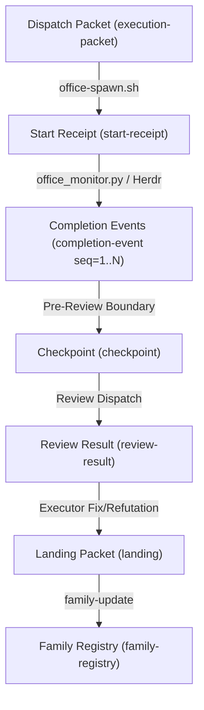

# Auto Office v3 — Runtime Contracts and Interface Specifications

## 1. Overview and Architecture of Shared Contracts

Auto Office v3 transitions from a single-threaded orchestrator running scripted conventions into a multi-project, portable, event-driven control plane supervising concurrent planner, executor, and reviewer families.

This document establishes the **authoritative, pinned runtime contracts** that downstream executors in Wave 1 (T1, T2, T3) and Wave 2 (T4) must implement and consume. Nothing specified here may be altered without an explicit versioned plan amendment.

### 1.1 Version Identity Triple

Every running entity, family, and handoff artifact in v3 is bound to three independent monotonic version integers (minimum value: 1):

1. `requirements_version`: The monotonic version of the user-confirmed, frozen problem statement, acceptance criteria, non-goals, and boundary constraints.
2. `plan_version`: The monotonic version of the implementation plan, dependency graph, wave sequence, task allocations, and shared interfaces.
3. `routing_version`: The monotonic version of the active role routing configuration, model@effort selections, candidate triples, and execution parameters.
4. `packet_version`: Retained as the packet envelope schema revision (currently `1`), not a substitute for the domain versions above.

**Core Invariant:** A change to routing (`routing_version`) updates dispatch routes without invalidating product requirements or plan approval. Conversely, an amendment to requirements or plan contracts pauses affected scopes and increments their respective versions while preserving unaffected work.

### 1.2 Session and Family Identity

- `session_id`: Unique string identifier for the active orchestrator conversation/session.
- `family_id`: Unique identifier for a project family (e.g. `repo#issue` or named family such as `fam-office-v3`).
- `dispatch_id`: Unique UUID identifying an individual agent process invocation.
- `task_id`: The milestone or work packet ID (e.g. `T0`, `T1`, `T4`).

### 1.3 State Directory Layout

Canonical run state lives under `$XDG_STATE_HOME/auto-office/runs/<run_id>/` (mirrored or referenced via `.office/` in the target repository):

```text
.office/
├── state.json                     # Core orchestrator lifecycle state
├── envelope.json                  # Top-level run envelope
├── family_registry.json           # Durable multi-family registry
├── families/
│   └── <family_id>/
│       ├── family.json            # Family state, versions, ownership
│       ├── focus.ref              # Pointer when this family has focus
│       ├── amendments/            # Recorded amendment operations
│       ├── checkpoints/           # Serialized role checkpoints
│       ├── landings/              # Validated completed task landings
│       └── reviews/               # Recorded review results
├── dispatches/
│   └── <dispatch_id>/
│       ├── packet.json            # Execution brief packet
│       ├── start_receipt.json     # Start confirmation
│       ├── output.log             # Stdout/stderr output stream
│       ├── exit_code              # Process exit code
│       └── meta.json              # Process metadata
└── events/
    ├── completions.jsonl          # Monotonic completion events
    └── cursor.json                # Last acknowledged event cursor
```

---

## 2. Pinned Contracts and Schemas

All schemas are pinned in JSON Schema Draft 2020-12 under `schemas/` and validated against fixtures under `tests/fixtures/`.

### 2.1 Dispatch Packet (`schemas/execution-packet.schema.json`)

Supersedes the legacy 10-field packet. Dispatches must carry full session and version provenance:

```json
{
  "$schema": "https://json-schema.org/draft/2020-12/schema",
  "title": "Auto Office v3 execution packet",
  "type": "object",
  "additionalProperties": false,
  "required": [
    "packet_id", "run_id", "family_id", "task_id",
    "requirements_version", "plan_version", "routing_version", "packet_version",
    "effective_config_hash", "base_sha", "selection_disclosure",
    "task_scope", "observable_outcome", "blast_radius",
    "allowed_mutations", "protected_paths", "validation_commands",
    "known_bad_behavior_to_exclude", "self_review", "rollback_or_restore_notes"
  ],
  "properties": {
    "packet_id": { "type": "string", "minLength": 1 },
    "run_id": { "type": "string", "minLength": 1 },
    "session_id": { "type": "string", "minLength": 1 },
    "family_id": { "type": "string", "minLength": 1 },
    "task_id": { "type": "string", "minLength": 1 },
    "requirements_version": { "type": "integer", "minimum": 1 },
    "plan_version": { "type": "integer", "minimum": 1 },
    "routing_version": { "type": "integer", "minimum": 1 },
    "packet_version": { "type": "integer", "minimum": 1 },
    "plan_path": { "type": "string" },
    "plan_sha": { "type": "string" },
    "effective_config_hash": { "type": "string", "minLength": 8 },
    "base_sha": { "type": "string", "minLength": 4 },
    "selection_disclosure": {
      "type": "object",
      "required": ["role", "triple", "invocation_model_id", "model_id", "effort", "harness", "harness_version", "reason"],
      "properties": {
        "role": { "type": "string" },
        "triple": { "type": "string" },
        "invocation_model_id": { "type": "string" },
        "model_id": { "type": "string" },
        "effort": { "type": "string" },
        "harness": { "type": "string" },
        "harness_version": { "type": "string" },
        "reason": { "type": "string" }
      }
    },
    "task_scope": { "type": ["string", "array"] },
    "observable_outcome": { "type": "string", "minLength": 1 },
    "blast_radius": { "type": ["string", "object", "array"] },
    "allowed_mutations": { "type": "array", "items": { "type": "string" } },
    "protected_paths": { "type": "array", "items": { "type": "string" } },
    "validation_commands": { "type": "array", "items": { "type": "string" } },
    "known_bad_behavior_to_exclude": { "type": ["string", "array"] },
    "self_review": { "type": ["string", "object", "array"] },
    "rollback_or_restore_notes": { "type": ["string", "object", "array"] },
    "escalation": { "type": "string" }
  }
}
```

### 2.2 Family Registry (`schemas/family-registry.schema.json`)

Maintains durable state for concurrent families managed by one orchestrator:

- `session_id`: ID of the supervising session.
- `current_focus_family_id`: The currently focused family for unqualified conversational interaction.
- `families`: Dictionary of family records keyed by `family_id`, containing:
  - `repo`, `issue`, `phase` (`intake | planning | execution | review | integration | closed`)
  - `requirements_version`, `plan_version`, `routing_version`
  - `ownership` (`holder_id`, `role`, `triple`)
  - `dependencies`, `active_dispatches`
  - `latest_landing` (`landing_id`, `task_id`, `head_sha`, `validation_evidence`, `evidence_hash`)
  - `pending_decisions` (`decision_id`, `summary`, `status`)

### 2.3 Amendment Operation (`schemas/amendment.schema.json`)

Typed state delta that mutates versions and notifies or pauses affected scopes:

- `amendment_id`, `family_id`, `session_id`
- `kind`: `routing | requirements | plan_contract`
- `affected_scopes`: Array of task or role scopes affected (e.g. `["T2", "T4"]`)
- `expected_prior_versions`: `{requirements_version, plan_version, routing_version}`
- `resulting_versions`: `{requirements_version, plan_version, routing_version}`
- `reason`: Narrative justification
- `evidence`: Direct observation or error text
- `evidence_hash`: `sha256:...` content hash

### 2.4 Landing Packet (`schemas/landing.schema.json`)

Durable receipt emitted by an executor upon task completion:

- `landing_id`, `family_id`, `producer` (`dispatch_id`, `holder_id`, `role`, `triple`)
- `scope`: Task ID or scope text
- `requirements_version`, `plan_version`, `routing_version`
- `base_sha`, `head_sha`, `diff_stat`
- `completed_tasks`: Array of completed task strings
- `decisions`: Array of design choices made
- `changes_and_interfaces`: Interfaces modified or introduced
- `validation_evidence`: `{commands, passed: true, output_summary, evidence_hash}`
- `review`: `{mode, round, dispositions, reviewer_id}`
- `deviations`, `dependencies_and_artifacts`, `blockers`

### 2.5 Checkpoint Packet (`schemas/checkpoint.schema.json`)

Emitted before adversarial review or context compaction. Inherits all fields of Landing Packet and adds:

- `checkpoint_id`
- `unresolved_concerns`: Array of items awaiting review or user guidance
- `next_phase`: Next lifecycle phase
- `serialized_at`: Timestamp

### 2.6 Review Result (`schemas/review-result.schema.json`)

Emitted by a reviewer or inline verifier:

- `review_id`, `dispatch_id` (producer dispatch), `producer_id`, `reviewer_id`, `reviewer_triple`
- `review_mode`: `independent_adversary | labeled-inline | integration_adversary`
- `reviewed_head_sha`
- `requirements_version`, `plan_version`, `routing_version`
- `review_scope`: Array of reviewed file/task scopes
- `disposition_owner`: `executor | planner | orchestrator`
- `overall_status`: `PASS | CHANGES_REQUIRED | PLAN_DEFECT | BRIEF_DEFECT | UNAVAILABLE`
- `findings`: Array of `{finding_id, status, severity, summary, evidence, evidence_hash}`
- `evidence`: Consolidated review evidence
- `evidence_hash`: `sha256:...`
- **Rule:** Inline review is explicitly labeled `review_mode: "labeled-inline"`. It cannot be represented as `independent_adversary`.

### 2.7 Completion Event (`schemas/completion-event.schema.json`)

Emitted by the monitoring subsystem (`office_monitor.py` / Herdr bridge):

- `event_id`, `session_id`, `family_id`, `dispatch_id`
- `sequence`: Monotonic positive integer for replay and deduplication
- `observed_status`: `finish | idle | blocked | unknown | disappeared | running`
- `terminal_classification`: `success | failure | cancelled | timeout | non_terminal`
- `source`: Source of event (e.g. `herdr`, `process_exit`, `monitor_bridge`)
- `evidence_timestamp`: ISO 8601 timestamp
- `evidence_hash`: `sha256:...`
- `evidence_payload`: Additional diagnostic payload

### 2.8 Start Receipt (`schemas/start-receipt.schema.json`)

Emitted by `office-spawn.sh` immediately upon process launch:

- `receipt_id`, `session_id`, `family_id`, `dispatch_id`, `pid`
- `requirements_version`, `plan_version`, `routing_version`
- `effective_config_hash`, `selection_disclosure`
- `adapter`, `model`, `effort`, `worktree`, `logfile`, `started_at`

### 2.9 Monitor Health (`schemas/monitor-health.schema.json`)

Heartbeat emitted by the monitor:

- `monitor_id`, `session_id`, `sequence`, `status` (`healthy | degraded | failing | stopped`)
- `active_panes`, `event_lag_ms`, `health_evidence`, `timestamp`

### 2.10 Replay Cursor (`schemas/replay-cursor.schema.json`)

Tracks orchestrator event consumption:

- `cursor_id`, `session_id`, `family_id`, `dispatch_id`
- `last_acknowledged_sequence`, `last_acknowledged_event_id`, `acknowledgement_hash`, `acknowledged_at`

---

## 3. Linkage and Traceability Architecture



### 3.1 Replacement Authority

When an amendment or operator command replaces a running dispatch:
1. Orchestrator emits an amendment (`kind: "routing"` or `"plan_contract"`).
2. If replacement is immediate, orchestrator records a completion event with `observed_status: "disappeared"` and `terminal_classification: "cancelled"`.
3. The running pane/process is terminated via signal or Herdr kill.
4. A replacement dispatch packet is generated with incremented `routing_version`, citing `replaced_dispatch_id`.
5. Running workers not explicitly marked for immediate replacement complete their current atomic round before the new route is applied.

---

## 4. Python Module Signatures (for T2 and T3)

The following signatures must be implemented in the respective modules:

### 4.1 `scripts/office_packets.py` (Owned by T2)

```python
def create_execution_packet(
    run_id: str,
    family_id: str,
    task_id: str,
    versions: tuple[int, int, int],  # (req, plan, route)
    task_scope: str | list[str],
    observable_outcome: str,
    blast_radius: dict | str,
    allowed_mutations: list[str],
    protected_paths: list[str],
    validation_commands: list[str],
    selection_disclosure: dict,
    effective_config_hash: str,
    base_sha: str,
    **kwargs
) -> dict:
    """Constructs and validates a v3 execution packet against execution-packet.schema.json."""
    ...

def validate_packet(packet_data: dict, schema_name: str = "execution-packet.schema.json") -> list[str]:
    """Validates packet against Draft 2020-12 schema, returning list of error strings."""
    ...

def invalidate_packets(state_dir: Path, plan_version: int, affected_scopes: list[str] | None = None) -> int:
    """Marks stale packets invalidated for given plan version and scopes."""
    ...
```

### 4.2 `scripts/office_family.py` (Owned by T2)

```python
def load_family_registry(state_dir: Path) -> dict:
    """Loads and validates family_registry.json with file locking."""
    ...

def update_family_focus(state_dir: Path, family_id: str) -> dict:
    """Atomically shifts conversational focus to family_id."""
    ...

def apply_amendment(
    state_dir: Path,
    family_id: str,
    kind: str,  # 'routing' | 'requirements' | 'plan_contract'
    affected_scopes: list[str],
    reason: str,
    evidence: str,
    evidence_hash: str,
    version_bumps: dict[str, int]
) -> dict:
    """Atomically applies amendment, updating versions and notifying affected scopes."""
    ...
```

### 4.3 `scripts/office_monitor.py` (Owned by T3)

```python
def record_completion_event(
    state_dir: Path,
    session_id: str,
    family_id: str,
    dispatch_id: str,
    observed_status: str,
    terminal_classification: str,
    source: str,
    evidence_payload: dict | None = None
) -> dict:
    """Appends a sequence-numbered event to events/completions.jsonl with deduplication."""
    ...

def get_event_cursor(state_dir: Path, session_id: str, dispatch_id: str) -> int:
    """Returns last acknowledged sequence number for dispatch."""
    ...

def acknowledge_events(state_dir: Path, session_id: str, dispatch_id: str, sequence: int) -> None:
    """Advances acknowledgement cursor up to sequence."""
    ...
```

---

## 5. Runtime CLI Signatures for T4 (Finding F6)

These exact CLI commands will be implemented by T2 in `scripts/office_runtime.py` and called by T4:

### 5.1 Family Management Commands

#### `family-show`
- **Invocation:** `python3 scripts/office_runtime.py family-show [--family-id <id>] [--state-dir <dir>]`
- **Behavior:** Reads family registry. If `--family-id` omitted, returns the current focus family. If focus is ambiguous and no family is specified, exits with code 3.
- **Output (stdout):** JSON object conforming to `family-registry.schema.json`'s family entry.
- **Exit Codes:** `0`: Success; `1`: Argument error; `2`: Registry corrupted; `3`: Ambiguous focus.

#### `family-focus`
- **Invocation:** `python3 scripts/office_runtime.py family-focus --family-id <id> [--state-dir <dir>]`
- **Behavior:** Updates `current_focus_family_id` in `family_registry.json`.
- **Output (stdout):** `{"status": "ok", "previous_focus": "<prev>", "current_focus": "<id>"}`
- **Exit Codes:** `0`: Success; `1`: Argument error; `2`: Family ID not found.

#### `family-list`
- **Invocation:** `python3 scripts/office_runtime.py family-list [--state-dir <dir>]`
- **Behavior:** Lists all registered families with phase and active versions.
- **Output (stdout):** `{"current_focus": "<id>", "families": [{"family_id": "...", "phase": "...", "versions": {"requirements": 1, "plan": 2, "routing": 2}}]}`
- **Exit Codes:** `0`: Success; `1`: Error.

#### `family-update`
- **Invocation:** `python3 scripts/office_runtime.py family-update --family-id <id> [--phase <phase>] [--latest-landing <file>] [--state-dir <dir>]`
- **Behavior:** Updates phase or latest landing for the family.
- **Output (stdout):** `{"status": "updated", "family_id": "<id>"}`
- **Exit Codes:** `0`: Success; `1`: Argument error; `2`: Validation error.

### 5.2 Amendment Commands

#### `amend`
- **Invocation:** `python3 scripts/office_runtime.py amend --kind <routing|requirements|plan_contract> --delta-file <file> [--family-id <id>] [--state-dir <dir>]`
- **Behavior:** Applies amendment file. Validates against `schemas/amendment.schema.json`. Updates version numbers per amendment matrix.
- **Output (stdout):** `{"status": "amended", "amendment_id": "...", "resulting_versions": {...}}`
- **Exit Codes:** `0`: Success; `1`: Argument error; `2`: Schema validation failure; `3`: Prior version mismatch / conflict.

### 5.3 Checkpoint Commands

#### `save-checkpoint`
- **Invocation:** `python3 scripts/office_runtime.py save-checkpoint --file <checkpoint.json> [--family-id <id>] [--state-dir <dir>]`
- **Behavior:** Validates against `schemas/checkpoint.schema.json`. Persists to `.office/families/<family_id>/checkpoints/<checkpoint_id>.json`.
- **Output (stdout):** `{"status": "saved", "checkpoint_id": "...", "path": "..."}`
- **Exit Codes:** `0`: Success; `1`: Argument error; `2`: Schema validation error.

#### `load-checkpoint`
- **Invocation:** `python3 scripts/office_runtime.py load-checkpoint (--file <file> | --checkpoint-id <id>) [--state-dir <dir>]`
- **Behavior:** Loads checkpoint and verifies schema.
- **Output (stdout):** Complete checkpoint JSON.
- **Exit Codes:** `0`: Success; `1`: Not found; `2`: Validation error.

#### `validate-checkpoint`
- **Invocation:** `python3 scripts/office_runtime.py validate-checkpoint <file>`
- **Behavior:** Pure schema validation of checkpoint file.
- **Output (stdout):** `{"valid": true}` or `{"valid": false, "errors": [...]}`
- **Exit Codes:** `0`: Valid; `2`: Invalid.

### 5.4 Landing Commands

#### `record-landing`
- **Invocation:** `python3 scripts/office_runtime.py record-landing --file <landing.json> [--family-id <id>] [--state-dir <dir>]`
- **Behavior:** Validates against `schemas/landing.schema.json`. Updates family's `latest_landing`.
- **Output (stdout):** `{"status": "recorded", "landing_id": "...", "head_sha": "..."}`
- **Exit Codes:** `0`: Success; `1`: Argument error; `2`: Schema validation error; `4`: Missing validation evidence.

#### `validate-landing`
- **Invocation:** `python3 scripts/office_runtime.py validate-landing <file>`
- **Behavior:** Validates against `schemas/landing.schema.json`.
- **Output (stdout):** `{"valid": true}` or `{"valid": false, "errors": [...]}`
- **Exit Codes:** `0`: Valid; `2`: Invalid.

#### `verify-landing`
- **Invocation:** `python3 scripts/office_runtime.py verify-landing --file <landing.json> [--strict]`
- **Behavior:** Re-runs commands in `validation_evidence.commands` or verifies commit SHA matches git working tree.
- **Output (stdout):** `{"verified": true, "head_sha": "..."}`
- **Exit Codes:** `0`: Verification passed; `4`: Verification failed.

### 5.5 Completion and Event Commands

#### `record-event`
- **Invocation:** `python3 scripts/office_runtime.py record-event (--file <file> | --event-id <id> --sequence <seq> --observed-status <status> --terminal-classification <class> --source <src> --evidence-timestamp <ts> --evidence-hash <hash>) [--state-dir <dir>]`
- **Behavior:** Validates against `schemas/completion-event.schema.json`. Appends to `.office/events/completions.jsonl`.
- **Output (stdout):** `{"status": "recorded", "event_id": "...", "sequence": <int>}`
- **Exit Codes:** `0`: Success; `1`: Argument error; `2`: Schema error; `3`: Sequence out of order.

#### `list-events`
- **Invocation:** `python3 scripts/office_runtime.py list-events [--dispatch-id <id>] [--since-seq <n>] [--state-dir <dir>]`
- **Behavior:** Returns array of recorded events matching filter.
- **Output (stdout):** `{"events": [...]}`
- **Exit Codes:** `0`: Success.

#### `ack-event`
- **Invocation:** `python3 scripts/office_runtime.py ack-event --dispatch-id <id> --sequence <n> [--state-dir <dir>]`
- **Behavior:** Updates replay cursor in `.office/events/cursor.json`.
- **Output (stdout):** `{"status": "acknowledged", "last_sequence": <n>}`
- **Exit Codes:** `0`: Success.

#### `completion-status`
- **Invocation:** `python3 scripts/office_runtime.py completion-status --dispatch-id <id> [--state-dir <dir>]`
- **Behavior:** Evaluates latest event and terminal classification for dispatch.
- **Output (stdout):** `{"dispatch_id": "...", "observed_status": "...", "terminal": true|false, "classification": "..."}`
- **Exit Codes:** `0`: Success; `1`: Dispatch not found.

### 5.6 Review and Start Receipt Commands

#### `record-start-receipt`
- **Invocation:** `python3 scripts/office_runtime.py record-start-receipt --file <receipt.json> [--state-dir <dir>]`
- **Behavior:** Validates against `schemas/start-receipt.schema.json`. Writes to `.office/dispatches/<dispatch_id>/start_receipt.json`.
- **Output (stdout):** `{"status": "recorded", "receipt_id": "..."}`
- **Exit Codes:** `0`: Success; `2`: Validation failure.

#### `record-review`
- **Invocation:** `python3 scripts/office_runtime.py record-review --file <review_result.json> [--state-dir <dir>]`
- **Behavior:** Validates against `schemas/review-result.schema.json`. Verifies provenance (producer != reviewer, tree SHA match, version match, non-empty evidence).
- **Output (stdout):** `{"status": "recorded", "review_id": "...", "overall_status": "..."}`
- **Exit Codes:** `0`: Success; `2`: Schema error; `4`: Provenance failure (self-approval, version mismatch, empty evidence).

#### `validate-review`
- **Invocation:** `python3 scripts/office_runtime.py validate-review <file>`
- **Behavior:** Validates against `schemas/review-result.schema.json`.
- **Output (stdout):** `{"valid": true}` or `{"valid": false, "errors": [...]}`
- **Exit Codes:** `0`: Valid; `2`: Invalid.

---

## 6. Review Loop Architecture Decision (Deliverable E)

### 6.1 Context and Problem Statement

`scripts/review_loop.sh:52-56` currently implements:
```bash
run_review() {
  # Mock independent review. In practice, this would invoke an agent or prompt.
  # We read from a REVIEW_STATUS env var, default to PASS.
  echo "${REVIEW_STATUS:-PASS}"
}
```
And `scripts/review_finding.sh:55` hardcodes:
```bash
"evidence_hash": "sha256:e3b0c44298fc1c149afbf4c8996fb92427ae41e4649b934ca495991b7852b855"
```
which is the sha256 hash of an empty string.

### 6.2 Survey of Callers in Codebase

A search across the repository found:
1. `SKILL.md:74`: Documents `scripts/review_loop.sh` as an active utility:
   `- scripts/review_loop.sh — multi-round verify/review/fix orchestrator enforcing no-self-approval and defect exits.`
2. `tests/test_review.py:38-50`: Tests `scripts/review_loop.sh` specifically for self-approval rejection (`test_review_loop_self_approval_rejected`), asserting exit code 4 when `dispatch_id == reviewer_id`.
3. `docs/plans/v3-final-merge.md:174`: Assigned to T4 write scope (`Touches: scripts/review_loop.sh, scripts/review_finding.sh...`).
4. No skills under `skills/` directly invoke `review_loop.sh`.

### 6.3 Recorded Decision: Option (a) — Replace Mock Callback with Real Review-Source Binding

**Decision:** T4 must **(a) replace the mock callback with a real review-source binding**. T4 must NOT retire `review_loop.sh`.

**Evidence and Rationale:**
1. `SKILL.md` and `tests/test_review.py` already establish `review_loop.sh` as a supported CLI boundary for scripted, multi-round review loops.
2. Retiring `review_loop.sh` (Option b) would leave no script-level loop harness for non-interactive test runs or batch reviews without creating a new utility.
3. Replacing `run_review()` with a real binding directly addresses finding F3 (positive-path provenance):
   - `review_loop.sh` will accept `--reviewer-dispatch-id <id>` and invoke `office_runtime.py validate-review` on `.office/reviews/<review_id>.json` or call `office_readback.sh --dispatch-id <reviewer-id>`.
   - If the reviewer output is missing, unset, or synthetic (e.g. unbound `REVIEW_STATUS`), `run_review()` returns `UNAVAILABLE` and exits 4 (fail closed).
   - Real PASS is returned ONLY when the reviewer dispatch has a validated `review-result` bound to: distinct reviewer identity (`producer != reviewer`), matching tree SHA, matching version triple, and non-empty evidence.
   - `review_finding.sh` will compute the actual `sha256sum` of the evidence file rather than outputting the hardcoded empty string hash.

---

## 7. Scoring, Trust, Capability Floors, Labels, Rewards, and Overrides (Deliverable F — Task T2B Contract)

This section defines the authoritative contract specification for Plan v3 Task T2B (`docs/plans/v3-final-merge.md`), establishing requirements for adapter trust qualification, per-role capability floors, outcome labelling, derived local rewards, and recorded override authorization.

### 7.1 Derived Adapter Trust Qualification (Deliverable F1)

#### 7.1.1 Qualification Thresholds
Under `config/config.default.yaml` (`adapter_trust`), an adapter candidate qualifies for trust-tier elevation from `candidate`/`quarantined` to `proven` (unlocking mutable-gate authority) only when historical dispatches in `runs.db` satisfy all of the following:
1. **Minimum Successful Dispatches:** At least `proven_min_successful_dispatches` (default: 5) dispatches with terminal outcome label `success` or `verified_no_observed_failure`.
2. **Minimum Distinct Task Shapes:** Successful dispatches must span at least `proven_min_task_shapes` (default: 2) distinct task shapes (`gear x playbook x route`).
3. **No Unresolved Adapter-Attributed Critical Failure:** There must be zero unresolved adapter-attributed critical failures in the adapter's direct or inherited lineage.

#### 7.1.2 Trust Evaluation SQL Query
The trust qualification status for a candidate triple (`:target_triple`) is evaluated against `runs.db` using the following query:

```sql
WITH adapter_dispatches AS (
    SELECT
        d.id AS dispatch_id,
        d.triple,
        d.task_shape,
        d.attribution,
        ol.label AS outcome_label,
        ol.primary_attribution AS label_attribution,
        (SELECT COUNT(*) FROM findings f
         WHERE f.dispatch_id = d.id AND f.severity IN ('critical', 'high')) AS blocking_findings
    FROM dispatches d
    LEFT JOIN outcome_labels ol ON ol.dispatch_id = d.id
    WHERE d.triple = :target_triple
),
qualification_summary AS (
    SELECT
        COUNT(CASE WHEN outcome_label IN ('success', 'verified_no_observed_failure')
                        AND blocking_findings = 0 THEN 1 END) AS successful_dispatches,
        COUNT(DISTINCT CASE WHEN outcome_label IN ('success', 'verified_no_observed_failure')
                                 AND blocking_findings = 0 THEN task_shape END) AS distinct_task_shapes,
        COUNT(CASE WHEN outcome_label IN ('recurrence_failure', 'material_post_merge_defect')
                        AND (attribution = 'adapter' OR label_attribution = 'adapter') THEN 1 END) AS critical_failures
    FROM adapter_dispatches
)
SELECT
    successful_dispatches,
    distinct_task_shapes,
    critical_failures,
    CASE
        WHEN critical_failures > 0 THEN 'quarantined'
        WHEN successful_dispatches >= 5 AND distinct_task_shapes >= 2 THEN 'proven'
        ELSE 'candidate'
    END AS qualified_trust_state
FROM qualification_summary;
```

#### 7.1.3 Unresolved Adapter-Attributed Critical Failure in Lineage
An unresolved adapter failure permanently blocks qualification. It is defined as:
- Any record in `runs.db` (`outcome_labels`, `dispatches`, or `findings`) where `primary_attribution = 'adapter'` (or `attribution = 'adapter'`) AND (`severity = 'critical'` OR `label IN ('recurrence_failure', 'material_post_merge_defect')`).
- **Resolution Requirement:** A critical failure is considered resolved IF AND ONLY IF an explicit remediation record exists in the `lineage` table where:
  - `component_kind = 'adapter'`
  - `component_id = :target_triple`
  - `event = 'resolved_adapter_defect'`
  - `multiplier > 0`
  - Accompanied by a non-empty `evidence_hash` referencing an approved regression test verifying the resolution. Without this entry, the adapter remains quarantined indefinitely.

---

### 7.2 Per-Role Capability Floor Contract (Deliverable F2)

#### 7.2.1 Format in `config/config.default.yaml`
Per-role floors are declared under `roles.<role>.floor` in `config/config.default.yaml`. For the shipped v3 baseline, floors are defined strictly over universally populated catalog fields:
```yaml
roles:
  <role_name>:
    floor:
      min_effort: <none | low | medium | high | xhigh | max>
      allowed_sources:
        - "local-evidence:"
        - "documented:"
      # Optional future benchmark constraint (absent from shipped default configuration):
      # min_benchmark_index:
      #   index_name: "Artificial Analysis Intelligence Index v4.3"
      #   min_score: <number>
```

#### 7.2.2 Evaluation Semantics and Fail-Closed Invariant
Evaluation of candidates against `roles.<role>.floor` proceeds through two primary checks:

1. **Effort Floor:** The candidate's `effort` is mapped against canonical effort ordering:
   $$\text{none} (0) < \text{low} (1) < \text{medium} (2) < \text{high} (3) < \text{xhigh} (4) < \text{max} (5)$$
   If $\text{rank}(\text{candidate.effort}) < \text{rank}(\text{floor.min\_effort})$, the candidate is rejected at Stage 4 with reason `effort below role floor (got <effort>, required <min_effort>)`.

2. **Invocation Source Provenance:** If `floor.allowed_sources` is defined, `candidate.invocation_source` must begin with one of the allowed prefixes (e.g. `local-evidence:`, `documented:`). Null slugs or unverified sources (`unverified:*`) are rejected at Stage 4 with reason `invocation_source not permitted by role floor`.

3. **Future Optional Benchmark Index Floor:**
   - In the shipped default configuration, `min_benchmark_index` is absent. When absent, no benchmark constraint is evaluated, and routing is unaffected.
   - When an operator enables `min_benchmark_index` (following a catalog refresh that populates benchmark scores), the router checks `candidate.benchmark_indexes[index_name] >= min_score`.
   - **No Exemptions:** If `min_benchmark_index` is configured, ANY candidate missing the named index or carrying an empty score dictionary **fails closed** with rejection reason `missing required catalog field 'benchmark_indexes.<index_name>'`. There are zero exemptions or bypasses for seed preferences.

4. **Universal Fail-Closed Rule for Missing Attributes:**
   When a capability floor requires any catalog attribute and that attribute is missing, null, or undefined in the candidate row:
   - The evaluation **MUST FAIL CLOSED**.
   - The router **MUST NEVER** treat unknown or null as passing.
   - The rejection record must explicitly name the missing field in `rejected[].reason`.

#### 7.2.3 Empirical Catalog Audit and Expressibility Analysis
An audit of `catalog/seed.yaml` (44 total model entries) reveals:
- **Universally Available Fields (100% populated, 0 null/empty):** `effort` (canonical effort enum), `invocation_source` (provenance string), `invocation_harness`, `model_id`.
- **Partially Available Fields:** `speed_fields` (6/44 null), `price_fields` (3/44 null), `content_hash` (3/44 null), `benchmark_indexes` (3/44 empty `{}`), `invocation_model_id` (18/44 null, all Claude entries unverified/non-dispatchable).
- **The Normative Seed Discovery:** The only 3 entries in `catalog/seed.yaml` with empty `benchmark_indexes: {}` and null price/speed fields are `opus`, `astra`, and `luna`. These three models are the **normative seed preferences** defined in `config/config.default.yaml` (`planner` -> opus, astra; `plan_reviewer` -> luna; `code_reviewer` -> luna).

**Architectural Conclusion on Capability Floor Expressibility:**
1. **Expressible Floor Today:** A robust, reliable capability floor CAN and MUST be expressed immediately against the fields that universally exist across 100% of catalog rows: `min_effort` and `allowed_sources`. This completely protects gate roles from unverified slugs and inadequate effort without opening exemptions.
2. **No Seed Holes:** An automatic exemption (such as `optional_if_seed_preference: true`) would exempt `opus`, `astra`, and `luna`—the exact models routed to on the default path—reopening the very hole Task T2B exists to close. No candidate is exempt from the floor.
3. **Prerequisite for Benchmark Bands:** An authoritative catalog refresh (`office_runtime.py catalog-snapshot`) that ingests benchmark scores for `opus`, `astra`, and `luna` is the required prerequisite before `min_benchmark_index` can be added to default configuration. Once added, it will fail closed on any candidate lacking benchmark data with zero exemptions.


---

### 7.3 Outcome Label Pipeline (Deliverable F3)

#### 7.3.1 Label Vocabulary
Dispatches and runs are classified using an authoritative vocabulary:
- `success`: Target goal completed; all automated verifications pass; independent review completed with zero unaddressed findings.
- `partial_success`: Functional goal met; verifications pass; minor non-blocking findings or acceptable deviations recorded.
- `defect_detected`: Reviewer identified material or blocking defects prior to closeout.
- `failed_verification`: Automated validations, test suites, or linters failed during execution.
- `operator_rejected`: Human operator rejected the plan, patch, or proposed action.
- `recurrence_failure`: Defect recurred in an area previously modified or flagged.
- `material_post_merge_defect`: Defect escaped review and was discovered post-merge or post-closeout.
- `abandoned`: Run was cancelled, timed out, or superseded before completion.
- `environment_failure`: Infrastructure, network, quota, or local host failure independent of model logic.

#### 7.3.2 Evidence Requirements
- **Mandatory Evidence:** Labels asserting verified technical status (`success`, `partial_success`, `defect_detected`, `failed_verification`, `recurrence_failure`, `material_post_merge_defect`) **MUST** include a non-empty SHA-256 evidence hash (`evidence_hash` matching `^sha256:[0-9a-f]{64}$`). Any attempt to record these labels without a valid hash is rejected.
- **Optional Evidence:** External terminations (`operator_rejected`, `abandoned`, `environment_failure`) may provide `evidence_hash = null` when no test log was generated.

#### 7.3.3 Table Schema and Write Lifecycle
Outcome labels are persisted in the `outcome_labels` table in `runs.db`:
```sql
CREATE TABLE IF NOT EXISTS outcome_labels (
    id TEXT PRIMARY KEY,
    dispatch_id TEXT NOT NULL REFERENCES dispatches(id),
    label TEXT NOT NULL,
    primary_attribution TEXT NOT NULL,
    contributing_attributions TEXT, -- JSON array of strings
    labeled_at TEXT NOT NULL,       -- ISO 8601 UTC
    evidence_hash TEXT              -- sha256:...
);
```
- **Lifecycle:** Outcome labels are append-only. A dispatch is labeled upon terminal transition (review completion, verification failure, or operator closeout). Once written, labels are immutable.

---

### 7.4 Derived Local Reward Formula (Deliverable F4)

#### 7.4.1 Reward Calculation
The derived local reward $R \in [-1.0, 1.0]$ summarizes historical outcome quality, review findings, and execution efficiency for a model/adapter candidate on a specific task shape:
$$R = \text{clamp}\left(R_{\text{base}} + \Delta_{\text{findings}} + \Delta_{\text{efficiency}}, -1.0, 1.0\right)$$

1. **Base Component ($R_{\text{base}}$):**
   - `success`: $+0.8$
   - `partial_success`: $+0.4$
   - `environment_failure`: $0.0$ (neutral, unpenalized)
   - `abandoned`: $-0.4$
   - `defect_detected`: $-0.5$
   - `failed_verification`: $-0.6$
   - `operator_rejected`: $-0.7$
   - `recurrence_failure`: $-0.9$
   - `material_post_merge_defect`: $-1.0$

2. **Findings Penalty ($\Delta_{\text{findings}}$):**
   $$\Delta_{\text{findings}} = - \left( 0.20 \times N_{\text{critical}} + 0.10 \times N_{\text{high}} + 0.02 \times N_{\text{medium}} \right)$$

3. **Efficiency Modifier ($\Delta_{\text{efficiency}}$):**
   Where cost and wall-clock time are measured against the task shape's reference budget:
   $$\Delta_{\text{efficiency}} = 0.10 \times \left(1.0 - \frac{\text{actual\_money}}{\text{budget\_money}}\right) \quad (\text{clamped to } [-0.10, 0.10])$$

#### 7.4.2 Representation of Missing Evidence (`None` vs `0.0`)
- When a candidate has not yet been dispatched on a task shape, or when outcome metrics are unmeasured, `local_reward` **MUST** evaluate to `None` (JSON `null`), **NEVER** `0.0`.
- **Rationale:** `0.0` represents an empirical neutral result (e.g., an environment failure or balanced trade-off). Assigning `0.0` to unmeasured candidates falsely asserts empirical evidence.

#### 7.4.3 Sorting Precedence in `route()`
During Stage 9 local tie-breaking, candidate rewards are sorted using explicit four-tier precedence:
1. **Positive Rewards ($R > 0$):** Sorted in descending order of reward value ($1.0 \to 0.01$).
2. **Unmeasured (`None`):** Placed below all positive candidates but ahead of measured neutral/negative candidates, ensuring unmeasured candidates receive exploratory consideration over known-inferior candidates.
3. **Neutral ($R == 0.0$):** Measured neutral evidence.
4. **Negative Rewards ($R < 0$):** Sorted in descending order (least negative first, e.g., $-0.1$ beats $-0.8$).

In Python tie-break sorting keys, this is represented by:
```python
def reward_sort_key(c):
    r = c.get("local_reward")
    if r is None:
        return (1, 0.0)       # Tier 1: Unmeasured (after positive)
    if r > 0:
        return (0, -float(r))  # Tier 0: Positive (sorted highest first)
    if r == 0:
        return (2, 0.0)       # Tier 2: Neutral
    return (3, -float(r))      # Tier 3: Negative (least negative first)
```

---

### 7.5 Recorded Override Mechanism (Deliverable F5)

#### 7.5.1 Override Record Schema
An override record grants explicit authorization to bypass Stage 2 (adapter unproven), Stage 4 (capability floor), or Stage 7 (advisory anchor undercut). It conforms to:
```json
{
  "$schema": "https://json-schema.org/draft/2020-12/schema",
  "title": "RecordedOverride",
  "type": "object",
  "required": [
    "override_id",
    "run_id",
    "family_id",
    "task_id",
    "role",
    "candidate_id",
    "bypass_stage",
    "rationale",
    "authorized_by",
    "authorized_at",
    "expires_at"
  ],
  "properties": {
    "override_id": {"type": "string", "format": "uuid"},
    "run_id": {"type": "string"},
    "family_id": {"type": "string"},
    "task_id": {"type": "string"},
    "role": {"type": "string"},
    "candidate_id": {"type": "string"},
    "bypass_stage": {"type": "integer", "enum": [2, 4, 7]},
    "rationale": {"type": "string", "minLength": 10},
    "authorized_by": {"type": "string", "enum": ["user"]},
    "authorized_at": {"type": "string", "format": "date-time"},
    "expires_at": {"type": "string", "format": "date-time"}
  },
  "additionalProperties": false
}
```

#### 7.5.2 Validation Rules
An override record is valid if and only if:
1. `authorized_by` is strictly `"user"`. Automated subagents cannot authorize overrides.
2. `expires_at` is strictly in the future relative to current UTC time.
3. `family_id`, `task_id`, `role`, and `candidate_id` match the active routing request context.
4. `rationale` contains a substantive justification ($\ge 10$ non-whitespace characters).
5. The override record is logged into `runs.db` before execution.

#### 7.5.3 Hard Stop in `route()`
When a routing request contains `allow_unverified_override: true` or `allow_override: true`:
- The router **MUST** verify the existence of a valid, unexpired recorded override matching the request context.
- If no valid record is present or if the record is expired, `route()` **MUST** halt immediately and return:
  ```json
  {
    "selected": null,
    "status": "override_not_authorized",
    "reason": "Execution requested unverified override without a valid recorded override authorization.",
    "rejected": []
  }
  ```
  with CLI exit code 1.

---

## 8. Verbatim Shared-File Blocks Owned Exclusively by Task T2 (Deliverable G)

Plan v3 strictly assigns `config/config.default.yaml` and `scripts/office_runtime.py` to **Task T2 exclusively**. Task T2 applies the blocks below verbatim as the sole owner of these two shared files. **Task T2B must NEVER edit or mutate either file**, and implements solely behind the delegation shim (within `scripts/office_routing.py`, `scripts/office_scoring.py`, `tests/test_scoring.py`, and `tests/test_derived_routing.py`). This strict task boundary ensures zero concurrent-write merge collisions in Wave 1.

### 8.1 Literal YAML Block for `config/config.default.yaml` (Deliverable G1)

In `config/config.default.yaml`, under the `roles:` dictionary, **Task T2** inserts the `floor:` specifications verbatim across standard roles (`planner`, `plan_reviewer`, `executor`, `worker`, `code_reviewer`, `browser_verifier`, and `closeout_verifier`). Task T2B reads this configuration but must never edit `config/config.default.yaml`.

```yaml
roles:
  orchestrator:
    router_selects: false
  planner:
    preferred_seed:
      - {model_id: opus, effort: medium}
      - {model_id: astra, effort: low}
    required_capabilities: [planning]
    floor:
      min_effort: low
      allowed_sources: ["local-evidence:", "documented:"]
  plan_reviewer:
    preferred_seed:
      - {model_id: luna, effort: xhigh}
    required_capabilities: [review]
    floor:
      min_effort: high
      allowed_sources: ["local-evidence:", "documented:"]
  executor:
    required_capabilities: [builder]
    floor:
      min_effort: medium
      allowed_sources: ["local-evidence:", "documented:"]
  worker:
    required_capabilities: []
    floor:
      min_effort: low
      allowed_sources: ["local-evidence:", "documented:"]
  code_reviewer:
    preferred_seed:
      - {model_id: luna, effort: xhigh}
    required_capabilities: [review]
    floor:
      min_effort: high
      allowed_sources: ["local-evidence:", "documented:"]
  browser_verifier:
    required_capabilities: [browser]
    floor:
      min_effort: low
      allowed_sources: ["local-evidence:"]
  closeout_verifier:
    required_capabilities: [verification]
    floor:
      min_effort: medium
      allowed_sources: ["local-evidence:", "documented:"]
```

---

### 8.2 Literal Python Delegation Shim for `scripts/office_runtime.py` (Deliverable G2)

In `scripts/office_runtime.py`, **Task T2** replaces the monolithic `route()` implementation and updates `cmd_route()` with the following delegation shim to `scripts/office_routing.py`. **Task T2B implements behind this boundary in `scripts/office_routing.py` and must never edit `scripts/office_runtime.py`.**

```python
def route(request: dict) -> dict:
    """Route a role dispatch request, delegating to scripts.office_routing."""
    try:
        from scripts import office_routing
    except ImportError:
        try:
            import office_routing
        except ImportError as exc:
            sys.stderr.write(
                f"ERROR: office_routing module unavailable ({exc}). "
                "Task T2B implementation of scripts/office_routing.py is required.\n"
            )
            return {
                "selected": None,
                "status": "routing_module_unavailable",
                "error": str(exc),
                "rejected": [],
            }

    # Hard stop: verify recorded override if unverified override requested
    if request.get("allow_unverified_override") or request.get("allow_override"):
        override_record = request.get("recorded_override")
        db_path = request.get("runs_db")
        if not hasattr(office_routing, "validate_override_record") or not office_routing.validate_override_record(
            override_record, request, db_path=db_path
        ):
            return {
                "selected": None,
                "status": "override_not_authorized",
                "reason": (
                    "Execution requested unverified override without a valid, unexpired "
                    "recorded override authorization in runs.db."
                ),
                "rejected": [],
            }

    return office_routing.route(request)


def cmd_route(args):
    """CLI handler for `office_runtime.py route <request_file>`."""
    req = load_data(args.request)
    result = route(req)
    dump_json(result)
    if result.get("status") in (
        "no_qualifying_candidate",
        "protected_quota_would_be_consumed",
        "override_not_authorized",
        "routing_module_unavailable",
    ):
        return 1
    return 0
```


