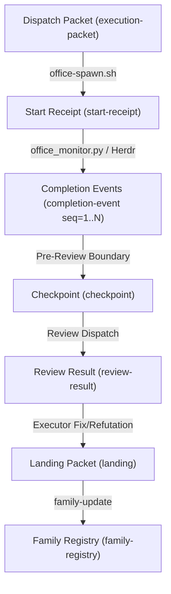

# Auto Office v3 — Runtime Contracts and Interface Specifications

## 1. Overview and Architecture of Shared Contracts

Auto Office v3 transitions from a single-threaded orchestrator running scripted conventions into a multi-project, portable, event-driven control plane supervising concurrent planner, executor, and reviewer families.

This document establishes the **authoritative, pinned runtime contracts** that downstream executors in Wave 1 (T1, T2, T3) and Wave 2 (T4) must implement and consume. Nothing specified here may be altered without an explicit versioned plan amendment.

### 1.1 Version Identity Triple

Every running entity, family, and handoff artifact in v3 is bound to three independent monotonic version integers (minimum value: 1):

1. `requirements_version`: The monotonic version of the user-confirmed, frozen problem statement, acceptance criteria, non-goals, and boundary constraints.
2. `plan_version`: The monotonic version of the implementation plan, dependency graph, wave sequence, task allocations, and shared interfaces.
3. `routing_version`: The monotonic version of the active role routing configuration, model@effort selections, candidate triples, and execution parameters.
4. `packet_version`: Retained as the packet envelope schema revision (currently `1`), not a substitute for the domain versions above.

**Core Invariant:** A change to routing (`routing_version`) updates dispatch routes without invalidating product requirements or plan approval. Conversely, an amendment to requirements or plan contracts pauses affected scopes and increments their respective versions while preserving unaffected work.

### 1.2 Session and Family Identity

- `session_id`: Unique string identifier for the active orchestrator conversation/session.
- `family_id`: Unique identifier for a project family (e.g. `repo#issue` or named family such as `fam-office-v3`).
- `dispatch_id`: Unique UUID identifying an individual agent process invocation.
- `task_id`: The milestone or work packet ID (e.g. `T0`, `T1`, `T4`).

### 1.3 State Directory Layout

Canonical run state lives under `$XDG_STATE_HOME/auto-office/runs/<run_id>/` (mirrored or referenced via `.office/` in the target repository):

```text
.office/
├── state.json                     # Core orchestrator lifecycle state
├── envelope.json                  # Top-level run envelope
├── family_registry.json           # Durable multi-family registry
├── families/
│   └── <family_id>/
│       ├── family.json            # Family state, versions, ownership
│       ├── focus.ref              # Pointer when this family has focus
│       ├── amendments/            # Recorded amendment operations
│       ├── checkpoints/           # Serialized role checkpoints
│       ├── landings/              # Validated completed task landings
│       └── reviews/               # Recorded review results
├── dispatches/
│   └── <dispatch_id>/
│       ├── packet.json            # Execution brief packet
│       ├── start_receipt.json     # Start confirmation
│       ├── output.log             # Stdout/stderr output stream
│       ├── exit_code              # Process exit code
│       └── meta.json              # Process metadata
└── events/
    ├── completions.jsonl          # Monotonic completion events
    └── cursor.json                # Last acknowledged event cursor
```

---

## 2. Pinned Contracts and Schemas

All schemas are pinned in JSON Schema Draft 2020-12 under `schemas/` and validated against fixtures under `tests/fixtures/`.

### 2.1 Dispatch Packet (`schemas/execution-packet.schema.json`)

Supersedes the legacy 10-field packet unconditionally: a packet carrying only the legacy fields
no longer validates. Dispatches must carry full session and version provenance — including
`session_id` itself, which Finding F13 identified as declared but not required in round 1 (a
packet could omit it and still validate clean, defeating "full session provenance").

**Finding R7 correction:** an earlier revision of this section claimed the excerpt below differed
from the committed schema only by the omitted `$schema` line, but array item constraints,
`selection_disclosure`'s optional fields, and `plan_path`/`plan_sha`'s `minLength` had drifted out
of sync with `schemas/execution-packet.schema.json`. The block below is regenerated directly from
the committed schema file (`json.dumps(schema_minus_dollar_schema, indent=2)`), so the claim is now
mechanical rather than asserted: `TestSchemas.test_packet_doc_excerpt_matches_committed_schema`
re-parses this block, adds back `$schema`, and asserts dict equality against the loaded schema
file on every test run, so the two cannot drift again without the test catching it. (The excerpt
still omits the `$schema` draft-identifier line itself for privacy-lint hygiene in this document;
the committed schema file carries it.)

**Finding R4 addition:** `replaced_dispatch_id` (optional, `string | null`) is required — non-null
— whenever this packet is issued as a replacement per §3.1 step 4 ("A replacement dispatch packet
is generated with incremented `routing_version`, citing `replaced_dispatch_id`"); it is omitted or
`null` for an initial (non-replacement) dispatch. It is schema-optional rather than
conditionally-required because the packet carries no separate boolean discriminator field for
"this is a replacement" — the presence of a non-null `replaced_dispatch_id` *is* that signal, so a
schema-level `if/then` would be circular. `office_packets.py` is the enforcement point: T2's
`create_execution_packet` must reject a call that claims `routing_version` was incremented due to
replacement (per the amendment that triggered it) without also passing `replaced_dispatch_id`.

```json
{
  "title": "Auto Office v3 execution packet",
  "type": "object",
  "additionalProperties": false,
  "properties": {
    "packet_id": {
      "type": "string",
      "minLength": 1
    },
    "run_id": {
      "type": "string",
      "minLength": 1
    },
    "session_id": {
      "type": "string",
      "minLength": 1
    },
    "family_id": {
      "type": "string",
      "minLength": 1
    },
    "task_id": {
      "type": "string",
      "minLength": 1
    },
    "requirements_version": {
      "type": "integer",
      "minimum": 1
    },
    "plan_version": {
      "type": "integer",
      "minimum": 1
    },
    "routing_version": {
      "type": "integer",
      "minimum": 1
    },
    "packet_version": {
      "type": "integer",
      "minimum": 1
    },
    "plan_path": {
      "type": "string",
      "minLength": 1
    },
    "plan_sha": {
      "type": "string",
      "minLength": 8
    },
    "effective_config_hash": {
      "type": "string",
      "minLength": 8
    },
    "base_sha": {
      "type": "string",
      "minLength": 4
    },
    "selection_disclosure": {
      "type": "object",
      "required": [
        "role",
        "triple",
        "invocation_model_id",
        "model_id",
        "effort",
        "harness",
        "harness_version",
        "reason"
      ],
      "properties": {
        "role": {
          "type": "string",
          "minLength": 1
        },
        "triple": {
          "type": "string",
          "minLength": 1
        },
        "invocation_model_id": {
          "type": "string",
          "minLength": 1
        },
        "model_id": {
          "type": "string",
          "minLength": 1
        },
        "effort": {
          "type": "string",
          "minLength": 1
        },
        "harness": {
          "type": "string",
          "minLength": 1
        },
        "harness_version": {
          "type": "string",
          "minLength": 1
        },
        "invocation_model_id_source": {
          "type": "string"
        },
        "reason": {
          "type": "string",
          "minLength": 1
        },
        "decision_hash": {
          "type": "string"
        }
      },
      "additionalProperties": true
    },
    "task_scope": {
      "type": [
        "string",
        "array"
      ]
    },
    "observable_outcome": {
      "type": "string",
      "minLength": 1
    },
    "blast_radius": {
      "type": [
        "string",
        "object",
        "array"
      ]
    },
    "allowed_mutations": {
      "type": "array"
    },
    "protected_paths": {
      "type": "array"
    },
    "validation_commands": {
      "type": "array"
    },
    "known_bad_behavior_to_exclude": {
      "type": [
        "string",
        "array"
      ]
    },
    "self_review": {
      "type": [
        "string",
        "object",
        "array"
      ]
    },
    "rollback_or_restore_notes": {
      "type": [
        "string",
        "object",
        "array"
      ]
    },
    "escalation": {
      "type": "string"
    },
    "replaced_dispatch_id": {
      "type": [
        "string",
        "null"
      ],
      "minLength": 1
    }
  },
  "required": [
    "packet_id",
    "run_id",
    "session_id",
    "family_id",
    "task_id",
    "requirements_version",
    "plan_version",
    "routing_version",
    "packet_version",
    "effective_config_hash",
    "base_sha",
    "selection_disclosure",
    "task_scope",
    "observable_outcome",
    "blast_radius",
    "allowed_mutations",
    "protected_paths",
    "validation_commands",
    "known_bad_behavior_to_exclude",
    "self_review",
    "rollback_or_restore_notes"
  ]
}
```

### 2.2 Family Registry (`schemas/family-registry.schema.json`)

Maintains durable state for concurrent families managed by one orchestrator:

- `session_id`: ID of the supervising session.
- `current_focus_family_id`: The currently focused family for unqualified conversational interaction.
- `families`: Dictionary of family records keyed by `family_id`, containing:
  - `repo`, `issue`, `phase` (`intake | planned | approved | executing | reviewed | closed` —
    **Finding R6 correction:** an earlier revision used a distinct, invented six-value vocabulary
    (`intake | planning | execution | review | integration | closed`) that diverged from the
    runtime's own authoritative lifecycle order. The runtime is authoritative for lifecycle phase;
    this enum is now exactly `PHASE_ORDER` from `scripts/office_runtime.py`, in the same order,
    with no schema-side renaming or reinterpretation.
    `TestSchemas.test_family_phase_enum_matches_runtime_phase_order` reads `PHASE_ORDER` from the
    real parent-repo `scripts/office_runtime.py` (not a copy) and asserts this schema's enum
    equals it exactly, so the two cannot diverge again silently.)
  - `requirements_version`, `plan_version`, `routing_version`
  - `ownership` (`holder_id`, `role`, `triple`)
  - `dependencies`, `active_dispatches`
  - `latest_landing` (`landing_id`, `task_id`, `head_sha`, `validation_evidence`, `evidence_hash`),
    which is `null` for a newly registered family that has not yet completed any task (issue-77
    kickoff registers family state before execution landings exist); once a landing exists, all
    listed subfields are required and validated strictly
  - `pending_decisions` (`decision_id`, `summary`, `status`)

### 2.3 Amendment Operation (`schemas/amendment.schema.json`)

Typed state delta that mutates versions and notifies or pauses affected scopes:

- `amendment_id`, `family_id`, `session_id`
- `kind`: `routing | requirements | plan_contract`
- `affected_scopes`: Array of task or role scopes affected (e.g. `["T2", "T4"]`)
- `expected_prior_versions`: `{requirements_version, plan_version, routing_version}`
- `resulting_versions`: `{requirements_version, plan_version, routing_version}`
- `reason`: Narrative justification
- `evidence`: Direct observation or error text
- `evidence_hash`: `sha256:...` content hash

### 2.4 Landing Packet (`schemas/landing.schema.json`)

Durable receipt emitted by an executor upon task completion:

- `landing_id`, `family_id`, `producer` (`dispatch_id`, `holder_id`, `role`, `triple`)
- `scope`: Task ID or scope text
- `requirements_version`, `plan_version`, `routing_version`
- `base_sha`, `head_sha`, `diff_stat`
- `completed_tasks`: Array of completed task strings
- `decisions`: Array of design choices made
- `changes_and_interfaces`: Interfaces modified or introduced
- `validation_evidence`: `{commands, passed: true, output_summary, evidence_hash}`
- `review`: `{mode, round, dispositions, reviewer_id}`
- `deviations`, `dependencies_and_artifacts`, `blockers`

### 2.5 Checkpoint Packet (`schemas/checkpoint.schema.json`)

Emitted before adversarial review or context compaction. Inherits all fields of Landing Packet and adds:

- `checkpoint_id`
- `unresolved_concerns`: Array of items awaiting review or user guidance
- `next_phase`: Next lifecycle phase
- `serialized_at`: Timestamp

### 2.6 Review Result (`schemas/review-result.schema.json`)

Emitted by a reviewer or inline verifier:

- `review_id`, `dispatch_id` (producer dispatch), `producer_id`, `reviewer_id`, `reviewer_triple`
- `review_mode`: `independent_adversary | labeled-inline | integration_adversary`
- `reviewed_head_sha`
- `requirements_version`, `plan_version`, `routing_version`
- `review_scope`: Array of reviewed file/task scopes
- `disposition_owner`: `executor | planner | orchestrator`
- `overall_status`: `PASS | CHANGES_REQUIRED | PLAN_DEFECT | BRIEF_DEFECT | UNAVAILABLE`
- `findings`: Array of `{finding_id, status, severity, summary, evidence, evidence_hash}`
- `evidence`: Consolidated review evidence
- `evidence_hash`: `sha256:...`
- **Rule:** Inline review is explicitly labeled `review_mode: "labeled-inline"`. It cannot be represented as `independent_adversary`.

### 2.7 Completion Event (`schemas/completion-event.schema.json`)

Emitted by the monitoring subsystem (`office_monitor.py` / Herdr bridge):

- `event_id`, `session_id`, `family_id`, `dispatch_id`
- `sequence`: Monotonic positive integer for replay and deduplication
- `observed_status`: `finish | idle | blocked | unknown | disappeared | running`
- `terminal_classification`: `success | failure | cancelled | timeout | non_terminal`
- `source`: Source of event (e.g. `herdr`, `process_exit`, `monitor_bridge`)
- `evidence_timestamp`: ISO 8601 timestamp
- `evidence_hash`: `sha256:...`
- `evidence_payload`: Additional diagnostic payload

### 2.8 Start Receipt (`schemas/start-receipt.schema.json`)

Emitted by `office-spawn.sh` immediately upon process launch:

- `receipt_id`, `session_id`, `family_id`, `dispatch_id`, `pid`
- `requirements_version`, `plan_version`, `routing_version`
- `effective_config_hash`, `selection_disclosure`
- `adapter`, `model`, `effort`, `worktree`, `logfile`, `started_at`

### 2.9 Monitor Health (`schemas/monitor-health.schema.json`)

Heartbeat emitted by the monitor:

- `monitor_id`, `session_id`, `sequence`, `status` (`healthy | degraded | failing | stopped`)
- `active_panes`, `event_lag_ms`, `health_evidence`, `timestamp`

### 2.10 Replay Cursor (`schemas/replay-cursor.schema.json`)

Tracks orchestrator event consumption:

- `cursor_id`, `session_id`, `family_id`, `dispatch_id`
- `last_acknowledged_sequence`, `last_acknowledged_event_id`, `acknowledgement_hash`, `acknowledged_at`

### 2.11 Run Envelope (`schemas/run-envelope.schema.json`)

Per-invocation record binding a dispatch to the exact policy, catalog, and adapter state it ran
under; written alongside `packet.json` at spawn time (`.office/dispatches/<dispatch_id>/`,
implicit in the layout in §1.3):

- `run_id`, `family_id`, `dispatch_id`, `role`, `holder_id`, `triple`
- `mode`, `playbook`, `base_sha`
- `policy_hash`, `catalog_snapshot_hash`, `adapter_snapshot_hash`, `effective_config_hash`
- `requirements_version`, `plan_version`, `routing_version`, `packet_version`
- `selection_disclosure` (optional; mirrors the packet's own `selection_disclosure` object)
- `session_id` (optional), `created_at`

**Finding R4 — partially rejected on evidence:** `requirements_version` and `routing_version` are
declared as properties but absent from `required`, unlike every other handoff artifact that
carries the version identity triple. Making them required, as R4 asks, is the wrong fix here: the
real `office_runtime.py::_new_run_envelope` (called from `cmd_start`) writes `envelope.json`
exactly once, at run kickoff, before planning or routing has run — `requirements_version` and
`routing_version` do not exist yet at that point, only `plan_version` (hardcoded `1`) and
`packet_version` (hardcoded `1`) do, and nothing ever rewrites `envelope.json` afterward to add
them once planning/routing establish real values. Requiring them unconditionally makes every
`start` call schema-invalid and was verified to break 25 previously-passing tests
(`python3 -m pytest tests/test_runtime.py tests/test_integration.py tests/test_dogfood.py -q`,
e.g. `StartCommandTests::test_envelope_validates_against_schema`,
`TestLifecycleIntegration::test_full_lifecycle`) — this is scripts/ behavior, outside this task's
write scope, and it is exercised, working code, not a bug to route around. `requirements_version`
and `routing_version` remain optional here by design: the run envelope pins the policy/catalog/
adapter snapshot a run started under, not the requirements/routing generation, which is why
`plan_version`/`packet_version` (fixed at kickoff) are required and `requirements_version`/
`routing_version` (not yet decided at kickoff) are not. If a later task wants the envelope to also
record requirements/routing generation, that requires a runtime change (rewriting `envelope.json`
once those versions are known) that is out of scope for a schema-only edit and belongs to whichever
task owns `scripts/office_runtime.py`.

---

## 3. Linkage and Traceability Architecture



### 3.1 Replacement Authority

When an amendment or operator command replaces a running dispatch:
1. Orchestrator emits an amendment (`kind: "routing"` or `"plan_contract"`).
2. If replacement is immediate, orchestrator records a completion event with `observed_status: "disappeared"` and `terminal_classification: "cancelled"`.
3. The running pane/process is terminated via signal or Herdr kill.
4. A replacement dispatch packet is generated with incremented `routing_version`, citing
   `replaced_dispatch_id` (the superseded dispatch's `dispatch_id`) — required non-null on any
   packet issued through this path; see the Finding R4 note in §2.1.
5. Running workers not explicitly marked for immediate replacement complete their current atomic round before the new route is applied.

### 3.2 Review Finding Status vs. Landing Disposition (Finding R6)

`review-result.schema.json`'s `findings[].status` (`accepted-material | accepted-minor |
rejected-on-evidence | deferred`) and `landing.schema.json`'s `review.dispositions[].disposition`
(`accepted | refuted | deferred | none`) are two vocabularies for the same RR→LP edge in the §3
diagram and had no pinned mapping, leaving T4 to invent one at integration time. The two are not
peers: `status` is the reviewer's authoritative assessment of a finding as of a given review round;
`disposition` is the executor's response to that assessment, recorded on the landing the executor
submits in reply.

| Review round assigns `status`... | ...executor's next landing must record `disposition` | Meaning |
|---|---|---|
| `accepted-material` | `accepted` | Executor agrees the defect is real and material; fixes it. |
| `accepted-minor` | `accepted` | Executor agrees the defect is real but minor; fixes or explicitly defers it (see below). |
| `rejected-on-evidence` | `none` | Reviewer (or orchestrator adjudicating on the executor's behalf) already determined the finding does not hold; no executor action is recorded against it. |
| `deferred` | `deferred` | Reviewer could not resolve the finding without a plan or requirements decision; executor takes no unilateral action and the finding rides to the next round unchanged. |
| *(any accepted-* status, contested)* | `refuted` | Executor disagrees with an `accepted-material`/`accepted-minor` status and submits counter-evidence instead of a fix. |

Transition rules:
- A `disposition: "refuted"` landing does not itself change the finding's `status`. The *next*
  review round must re-adjudicate that finding_id and record exactly one of `accepted-material`,
  `accepted-minor` (refutation rejected, defect stands — the executor must then land a
  same-finding `accepted` disposition), or `rejected-on-evidence` (refutation accepted, defect
  struck). A finding cannot stay `accepted-*` across two consecutive rounds while its most recent
  landing recorded `refuted` for it — that combination means the review loop stalled and must be
  escalated as a plan defect, not silently re-reviewed forever.
- `disposition: "none"` is valid only in response to `rejected-on-evidence` or to a finding_id not
  present in the round's `review-result` at all. Recording `none` against a live
  `accepted-material`/`accepted-minor` finding is itself a landing defect (a disguised, unrecorded
  refutation) and `record-landing` should reject it if `--strict` provenance checking is enabled.
- `deferred` is non-terminal on both sides: a `status: "deferred"` finding must resolve to one of
  the other three statuses before the family may transition its `phase` (§2.2) to `closed`.

---

## 4. Python Module Signatures (for T2 and T3)

The following signatures must be implemented in the respective modules:

### 4.1 `scripts/office_packets.py` (Owned by T2)

```python
def create_execution_packet(
    run_id: str,
    session_id: str,
    family_id: str,
    task_id: str,
    versions: tuple[int, int, int],  # (req, plan, route)
    packet_version: int,
    task_scope: str | list[str],
    observable_outcome: str,
    blast_radius: dict | str,
    allowed_mutations: list[str],
    protected_paths: list[str],
    validation_commands: list[str],
    selection_disclosure: dict,
    effective_config_hash: str,
    base_sha: str,
    replaced_dispatch_id: str | None = None,
    **kwargs
) -> dict:
    """Constructs and validates a v3 execution packet against execution-packet.schema.json.

    Finding R4 correction: `session_id` and `packet_version` were previously reachable only via
    `**kwargs`, so a caller could omit them and get a TypeError from schema validation deep inside
    the function instead of a missing-argument error at the call site. Both are named parameters
    now, matching their presence in `execution-packet.schema.json`'s `required` list. `**kwargs`
    remains for truly optional fields (`plan_path`, `plan_sha`, `escalation`).
    """
    ...

def validate_packet(packet_data: dict, schema_name: str = "execution-packet.schema.json") -> list[str]:
    """Validates packet against Draft 2020-12 schema, returning list of error strings."""
    ...

def invalidate_packets(state_dir: Path, plan_version: int, affected_scopes: list[str] | None = None) -> int:
    """Marks stale packets invalidated for given plan version and scopes."""
    ...
```

### 4.2 `scripts/office_family.py` (Owned by T2)

```python
def load_family_registry(state_dir: Path) -> dict:
    """Loads and validates family_registry.json with file locking."""
    ...

def update_family_focus(state_dir: Path, family_id: str) -> dict:
    """Atomically shifts conversational focus to family_id."""
    ...

def apply_amendment(
    state_dir: Path,
    family_id: str,
    kind: str,  # 'routing' | 'requirements' | 'plan_contract'
    affected_scopes: list[str],
    reason: str,
    evidence: str,
    evidence_hash: str,
    version_bumps: dict[str, int]
) -> dict:
    """Atomically applies amendment, updating versions and notifying affected scopes."""
    ...
```

### 4.3 `scripts/office_monitor.py` (Owned by T3)

**Finding R5 correction:** this section previously omitted `event_id`, `evidence_timestamp`, and
`evidence_hash` from `record_completion_event`, and omitted `family_id` from both cursor functions
and `event_id` from `acknowledge_events` — even though `completion-event.schema.json` requires all
three of the first group and `replay-cursor.schema.json` keys its cursor on `(session_id,
family_id, dispatch_id)` and requires `last_acknowledged_event_id`. A T3 implementation following
only the earlier signatures could not construct a schema-valid event or a correctly-keyed cursor.
All four are now named parameters, matching the CLI flag forms already pinned in §5.5.

```python
def record_completion_event(
    state_dir: Path,
    event_id: str,
    session_id: str,
    family_id: str,
    dispatch_id: str,
    sequence: int,
    observed_status: str,
    terminal_classification: str,
    source: str,
    evidence_timestamp: str,
    evidence_hash: str,
    evidence_payload: dict | None = None
) -> dict:
    """Appends a sequence-numbered event to events/completions.jsonl with deduplication.

    `event_id` is caller-supplied but must equal the deterministic derivation
    `"evt-" + sha256(f"{dispatch_id}:{sequence}")[:16]` (Finding R5); a caller-supplied value that
    does not match is a schema/argument error (CLI exit 1), not silently accepted. Two calls for
    the same `(dispatch_id, sequence)` therefore always compute the same `event_id`, which is what
    makes "with deduplication" concrete: a second call for an already-recorded `(dispatch_id,
    sequence)` is a no-op that returns the existing row rather than appending a duplicate.
    Recording a *different* `sequence` for the same `dispatch_id` is a new event, never a mutation
    of a prior one — `completions.jsonl` is append-only.
    """
    ...

def get_event_cursor(state_dir: Path, session_id: str, family_id: str, dispatch_id: str) -> int:
    """Returns last acknowledged sequence number for (session_id, family_id, dispatch_id).

    The cursor is keyed by all three (Finding R5) because `cursor_id` in §5.5 is
    `"cur-" + sha256(f"{session_id}:{family_id}:{dispatch_id}")[:12]` — a lookup missing
    `family_id` cannot reconstruct the same `cursor_id` and would silently read the wrong cursor
    (or none) whenever a session runs more than one family, which is the normal case.
    """
    ...

def acknowledge_events(
    state_dir: Path,
    session_id: str,
    family_id: str,
    dispatch_id: str,
    sequence: int,
    event_id: str
) -> dict:
    """Advances the replay cursor for (session_id, family_id, dispatch_id) up to sequence.

    `event_id` is required (Finding R5) because §5.5's `ack-event` contract validates it against
    the stored event at `sequence` and rejects a mismatch as an argument error rather than silently
    acking the wrong event on a sequence collision; this function is that validation's only
    implementation point, so it must receive `event_id` to perform the check. Duplicate
    (`sequence` <= current `last_acknowledged_sequence`) and out-of-order (`sequence` > current + 1)
    handling, and the exact `cursor_id`/`acknowledgement_hash` generation formulas, are pinned once
    in §5.5's `ack-event` and not repeated here to avoid the two drifting apart; this function
    implements that contract exactly, including its return shape (`status`,
    `last_acknowledged_sequence`, `last_acknowledged_event_id`, `acknowledgement_hash`).
    """
    ...
```

---

## 5. Runtime CLI Signatures for T4 (Finding F6)

These exact CLI commands will be implemented by T2 in `scripts/office_runtime.py` and called by T4:

### 5.1 Family Management Commands

#### `family-show`
- **Invocation:** `python3 scripts/office_runtime.py family-show [--family-id <id>] [--state-dir <dir>]`
- **Behavior:** Reads family registry. If `--family-id` omitted, returns the current focus family. If focus is ambiguous and no family is specified, exits with code 3.
- **Output (stdout):** JSON object conforming to `family-registry.schema.json`'s family entry.
- **Exit Codes:** `0`: Success; `1`: Argument error; `2`: Registry corrupted; `3`: Ambiguous focus.

#### `family-focus`
- **Invocation:** `python3 scripts/office_runtime.py family-focus --family-id <id> [--state-dir <dir>]`
- **Behavior:** Updates `current_focus_family_id` in `family_registry.json`.
- **Output (stdout):** `{"status": "ok", "previous_focus": "<prev>", "current_focus": "<id>"}`
- **Exit Codes:** `0`: Success; `1`: Argument error; `2`: Family ID not found.

#### `family-list`
- **Invocation:** `python3 scripts/office_runtime.py family-list [--state-dir <dir>]`
- **Behavior:** Lists all registered families with phase and active versions.
- **Output (stdout):** `{"current_focus": "<id>", "families": [{"family_id": "...", "phase": "...", "versions": {"requirements_version": 1, "plan_version": 2, "routing_version": 2}}]}`. Field names inside `versions` match `family-registry.schema.json`'s `requirements_version`/`plan_version`/`routing_version` exactly, so `family-update` and any consumer read the same names the schema requires.
- **Exit Codes:** `0`: Success; `1`: Error.

#### `family-update`
- **Invocation:** `python3 scripts/office_runtime.py family-update --family-id <id> [--phase <phase>] [--latest-landing <file>] [--issue <number-or-url>] [--state-dir <dir>]`
- **Behavior:** Updates the family's phase, latest landing, or tracking issue number/URL.
- **Output (stdout):** `{"status": "updated", "family_id": "<id>"}`
- **Exit Codes:** `0`: Success; `1`: Argument error; `2`: Validation error.

### 5.2 Amendment Commands

#### `amend`
- **Invocation:** `python3 scripts/office_runtime.py amend --kind <routing|requirements|plan_contract> --delta-file <file> [--family-id <id>] [--state-dir <dir>]`
- **Behavior:** Applies amendment file. Validates against `schemas/amendment.schema.json`. Updates version numbers per amendment matrix.
- **Output (stdout):** `{"status": "amended", "amendment_id": "...", "resulting_versions": {...}}`
- **Exit Codes:** `0`: Success; `1`: Argument error; `2`: Schema validation failure; `3`: Prior version mismatch / conflict.

### 5.3 Checkpoint Commands

#### `save-checkpoint`
- **Invocation:** `python3 scripts/office_runtime.py save-checkpoint --file <checkpoint.json> [--family-id <id>] [--state-dir <dir>]`
- **Behavior:** Validates against `schemas/checkpoint.schema.json`. Persists to `.office/families/<family_id>/checkpoints/<checkpoint_id>.json`.
- **Output (stdout):** `{"status": "saved", "checkpoint_id": "...", "path": "..."}`
- **Exit Codes:** `0`: Success; `1`: Argument error; `2`: Schema validation error.

#### `load-checkpoint`
- **Invocation:** `python3 scripts/office_runtime.py load-checkpoint (--file <file> | --checkpoint-id <id>) [--state-dir <dir>]`
- **Behavior:** Loads checkpoint and verifies schema.
- **Output (stdout):** Complete checkpoint JSON.
- **Exit Codes:** `0`: Success; `1`: Not found; `2`: Validation error.

#### `validate-checkpoint`
- **Invocation:** `python3 scripts/office_runtime.py validate-checkpoint <file>`
- **Behavior:** Pure schema validation of checkpoint file.
- **Output (stdout):** `{"valid": true}` or `{"valid": false, "errors": [...]}`
- **Exit Codes:** `0`: Valid; `2`: Invalid.

### 5.4 Landing Commands

#### `record-landing`
- **Invocation:** `python3 scripts/office_runtime.py record-landing --file <landing.json> [--family-id <id>] [--state-dir <dir>]`
- **Behavior:** Validates against `schemas/landing.schema.json`. Updates family's `latest_landing`.
- **Output (stdout):** `{"status": "recorded", "landing_id": "...", "head_sha": "..."}`
- **Exit Codes:** `0`: Success; `1`: Argument error; `2`: Schema validation error; `4`: Missing validation evidence.

#### `validate-landing`
- **Invocation:** `python3 scripts/office_runtime.py validate-landing <file>`
- **Behavior:** Validates against `schemas/landing.schema.json`.
- **Output (stdout):** `{"valid": true}` or `{"valid": false, "errors": [...]}`
- **Exit Codes:** `0`: Valid; `2`: Invalid.

#### `verify-landing`
- **Invocation:** `python3 scripts/office_runtime.py verify-landing --file <landing.json> [--strict]`
- **Behavior:** Re-runs commands in `validation_evidence.commands` or verifies commit SHA matches git working tree.
- **Output (stdout):** `{"verified": true, "head_sha": "..."}`
- **Exit Codes:** `0`: Verification passed; `4`: Verification failed.

### 5.5 Completion and Event Commands

#### `record-event`
- **Invocation:** `python3 scripts/office_runtime.py record-event (--file <file> | --event-id <id> --session-id <id> --family-id <id> --dispatch-id <id> --sequence <seq> --observed-status <status> --terminal-classification <class> --source <src> --evidence-timestamp <ts> --evidence-hash <hash>) [--evidence-payload <json>] [--state-dir <dir>]`
- **Behavior:** Validates against `schemas/completion-event.schema.json`. Appends to `.office/events/completions.jsonl`.
  **Finding F19 correction:** round 1's flag form omitted `--session-id`, `--family-id`, and
  `--dispatch-id`, all three of which the schema requires (`event_id`, `session_id`, `family_id`,
  `dispatch_id`, `sequence`, `observed_status`, `terminal_classification`, `source`,
  `evidence_timestamp`, `evidence_hash` are all required); a flag-form invocation using only the
  previously-documented flags cannot pass schema validation, forcing T3 to invent undocumented
  flags to produce a valid event. All three identity flags are now listed above and are mandatory
  in the flag form exactly as they are in `--file` form.
  **Finding R5 addition:** `--event-id` must equal `"evt-" + sha256(f"{dispatch_id}:{sequence}")[:16]`
  (see §4.3); a caller-supplied value that does not match this derivation is an argument error
  (exit `1`), so `--event-id` is a required, checked echo of a deterministic value rather than an
  independent identifier the caller is free to choose.
- **Output (stdout):** `{"status": "recorded", "event_id": "...", "sequence": <int>}`
- **Exit Codes:** `0`: Success; `1`: Argument error; `2`: Schema error; `3`: Sequence out of order.

#### `list-events`
- **Invocation:** `python3 scripts/office_runtime.py list-events [--dispatch-id <id>] [--since-seq <n>] [--state-dir <dir>]`
- **Behavior:** Returns array of recorded events matching filter.
- **Output (stdout):** `{"events": [...]}`
- **Exit Codes:** `0`: Success.

#### `ack-event`
- **Invocation:** `python3 scripts/office_runtime.py ack-event --session-id <id> --family-id <id> --dispatch-id <id> --sequence <n> --event-id <id> [--state-dir <dir>]`
- **Behavior:** Advances the replay cursor for `(session_id, family_id, dispatch_id)` in `.office/events/cursor.json`, validated against `schemas/replay-cursor.schema.json` (Finding F9). Every field that schema requires is generated or supplied exactly as follows:
  - `cursor_id`: deterministic, so restart reconstructs the same cursor object rather than creating a duplicate — `"cur-" + sha256(f"{session_id}:{family_id}:{dispatch_id}")[:12]`.
  - `last_acknowledged_event_id`: the CLI reads the event at `--sequence` from `.office/events/completions.jsonl` and requires its stored `event_id` to equal `--event-id`; a mismatch is an argument error (exit `1`), not a silent overwrite, because it means the caller is acking the wrong event on a sequence collision.
  - `acknowledgement_hash`: `"sha256:" + sha256(f"{dispatch_id}:{sequence}:{event_id}")` over the acked dispatch/sequence/event triple, so the hash changes if any of the three changes.
  - `acknowledged_at`: current UTC timestamp at write time, ISO 8601.
  - **Duplicate acknowledgement** (`--sequence` <= the cursor's current `last_acknowledged_sequence`): idempotent no-op. The existing cursor record is returned unchanged with `"status": "already_acknowledged"` and exit `0`; no new cursor write occurs.
  - **Out-of-order acknowledgement** (`--sequence` > current `last_acknowledged_sequence + 1`, i.e. it would skip an unacknowledged event): rejected without writing a cursor, exit `3`, `{"status": "sequence_gap", "expected": <current+1>, "got": <n>}`.
  - **In-order acknowledgement** (`--sequence` == current `last_acknowledged_sequence + 1`, or the first ack when no cursor exists yet): the cursor advances and is persisted.
- **Output (stdout):** `{"status": "acknowledged" | "already_acknowledged", "cursor_id": "...", "last_acknowledged_sequence": <n>, "last_acknowledged_event_id": "...", "acknowledgement_hash": "sha256:..."}`
- **Exit Codes:** `0`: Success (including idempotent duplicate); `1`: Argument error or event-ID mismatch at the given sequence; `2`: Schema validation error; `3`: Sequence gap (out-of-order).

#### `completion-status`
- **Invocation:** `python3 scripts/office_runtime.py completion-status --dispatch-id <id> [--state-dir <dir>]`
- **Behavior:** Evaluates latest event and terminal classification for dispatch.
- **Output (stdout):** `{"dispatch_id": "...", "observed_status": "...", "terminal": true|false, "classification": "..."}`
- **Exit Codes:** `0`: Success; `1`: Dispatch not found.

### 5.6 Review and Start Receipt Commands

#### `record-start-receipt`
- **Invocation:** `python3 scripts/office_runtime.py record-start-receipt --file <receipt.json> [--state-dir <dir>]`
- **Behavior:** Validates against `schemas/start-receipt.schema.json`. Writes to `.office/dispatches/<dispatch_id>/start_receipt.json`.
- **Output (stdout):** `{"status": "recorded", "receipt_id": "..."}`
- **Exit Codes:** `0`: Success; `2`: Validation failure.

#### `record-review`
- **Invocation:** `python3 scripts/office_runtime.py record-review --file <review_result.json> [--state-dir <dir>]`
- **Behavior:** Validates against `schemas/review-result.schema.json`. Verifies provenance (producer != reviewer, tree SHA match, version match, non-empty evidence).
- **Output (stdout):** `{"status": "recorded", "review_id": "...", "overall_status": "..."}`
- **Exit Codes:** `0`: Success; `2`: Schema error; `4`: Provenance failure (self-approval, version mismatch, empty evidence).

#### `validate-review`
- **Invocation:** `python3 scripts/office_runtime.py validate-review <file>`
- **Behavior:** Validates against `schemas/review-result.schema.json`.
- **Output (stdout):** `{"valid": true}` or `{"valid": false, "errors": [...]}`
- **Exit Codes:** `0`: Valid; `2`: Invalid.

---

## 6. Review Loop Architecture Decision (Deliverable E)

### 6.1 Context and Problem Statement

`scripts/review_loop.sh:52-56` currently implements:
```bash
run_review() {
  # Mock independent review. In practice, this would invoke an agent or prompt.
  # We read from a REVIEW_STATUS env var, default to PASS.
  echo "${REVIEW_STATUS:-PASS}"
}
```
And `scripts/review_finding.sh:55` hardcodes:
```bash
"evidence_hash": "sha256:e3b0c44298fc1c149afbf4c8996fb92427ae41e4649b934ca495991b7852b855"
```
which is the sha256 hash of an empty string.

### 6.2 Survey of Callers in Codebase

A search across the repository found:
1. `SKILL.md:74`: Documents `scripts/review_loop.sh` as an active utility:
   `- scripts/review_loop.sh — multi-round verify/review/fix orchestrator enforcing no-self-approval and defect exits.`
2. `tests/test_review.py:38-50`: Tests `scripts/review_loop.sh` specifically for self-approval rejection (`test_review_loop_self_approval_rejected`), asserting exit code 4 when `dispatch_id == reviewer_id`.
3. `docs/plans/v3-final-merge.md:174`: Assigned to T4 write scope (`Touches: scripts/review_loop.sh, scripts/review_finding.sh...`).
4. No skills under `skills/` directly invoke `review_loop.sh`.

### 6.3 Recorded Decision: Option (a) — Replace Mock Callback with Real Review-Source Binding

**Decision:** T4 must **(a) replace the mock callback with a real review-source binding**. T4 must NOT retire `review_loop.sh`.

**Evidence and Rationale:**
1. `SKILL.md` and `tests/test_review.py` already establish `review_loop.sh` as a supported CLI boundary for scripted, multi-round review loops.
2. Retiring `review_loop.sh` (Option b) would leave no script-level loop harness for non-interactive test runs or batch reviews without creating a new utility.
3. Replacing `run_review()` with a real binding directly addresses finding F3 (positive-path provenance):
   - `review_loop.sh` will accept `--reviewer-dispatch-id <id>` and invoke `office_runtime.py validate-review` on `.office/reviews/<review_id>.json` or call `office_readback.sh --dispatch-id <reviewer-id>`.
   - If the reviewer output is missing, unset, or synthetic (e.g. unbound `REVIEW_STATUS`), `run_review()` returns `UNAVAILABLE` and exits 4 (fail closed).
   - Real PASS is returned ONLY when the reviewer dispatch has a validated `review-result` bound to: distinct reviewer identity (`producer != reviewer`), matching tree SHA, matching version triple, and non-empty evidence.
   - `review_finding.sh` will compute the actual `sha256sum` of the evidence file rather than outputting the hardcoded empty string hash.

---

## 7. Scoring, Trust, Capability Floors, Labels, Rewards, and Overrides (Deliverable F — Task T2B Contract)

This section defines the authoritative contract specification for Plan v3 Task T2B (`docs/plans/v3-final-merge.md`), establishing requirements for adapter trust qualification, per-role capability floors, outcome labelling, derived local rewards, and recorded override authorization.

### 7.1 Derived Adapter Trust Qualification (Deliverable F1, narrowed by Amendment v5)

**Amendment v5 (`docs/plans/v3-final-merge.md`, `version: 5`; authority: commit `56b4155` on
`auto-office-v3`, user disposition) is the governing requirement for this section.** Five rounds of
independent review (F3, F12, F21, F27, and finally R1/R2/R3 in review round 5) each found the trust
query's promotion path satisfiable by evidence it was supposed to require — self-reported labels,
misattributed validations, unscoped resolutions — and each fix was a correct, narrower patch that
still left an upward-from-evidence path for the next round to find. Amendment v5's disposition is
to stop narrowing and remove the class: **a query may lower adapter trust and it may never raise
it.** Concretely:
- Any **downward** transition (anything → `quarantined`) is derived from recorded evidence by
  query, with no human action — this is what §7.1.2 below still computes.
- Any **upward** transition (`quarantined` → `valid-unverified`, anything → `proven`) is an
  **explicit recorded act** carrying its own attribution (§7.1.4). It is never computed from a
  count, a label, a validation row, or any other query result. R1 (self-reported labels), R2
  (unscoped resolution), and R3 (no independent authority before clearing quarantine) are all
  attacks that move trust upward using forged or misattributed evidence; under this rule there is
  no upward path reachable by evidence at all, so none of the three has a target. This is not a
  narrower version of the old promotion query — the promotion query is deleted, not patched.

#### 7.1.1 Quarantine Trigger and the Trust-State Floor
Under `config/config.default.yaml` (`adapter_trust`), an adapter's trust state can only ever be
automatically *lowered*, never raised, by the query in §7.1.2:
1. **No Unresolved Adapter-Attributed Critical Failure:** There must be zero unresolved
   adapter-attributed critical failures in the adapter's direct or inherited lineage (§7.1.3). This
   is the sole automatic quarantine trigger.
2. **The floor, absent any explicit trust act, is `valid-unverified`** — never `proven`, no matter
   how many successful dispatches or how many distinct task shapes an adapter has accumulated. A
   trust act is required to reach `proven` even from a spotless dispatch history (§7.1.4).

`adapter_trust.proven_min_successful_dispatches` (default: 5) and `adapter_trust.proven_min_task_shapes`
(default: 2) remain defined in `config/config.default.yaml` — amendment v5 bars parametric changes
to config values, and these are not evidential thresholds a query evaluates automatically anymore.
They are **advisory reference numbers** an actor may consult before recording an explicit `proven`
trust act (§7.1.4); no query binds them, and meeting or exceeding them has no automatic effect.

A dispatch may be labeled more than once over time (`outcome_labels` is append-only, §7.3.3).
Quarantine derivation evaluates **every** qualifying label ever recorded against a dispatch, not
the latest one: failure evidence latches (§7.1.2), and reading only the newest row is the exact
laundering path amendment v6 exists to close. De-duplication is by **distinct dispatch**, not by
recency — property 5 of the evidence checklist — so re-recording the same self-reported label
cannot multiply a dispatch's contribution to any derived count, while a later benign label cannot
retract an earlier failure either.

#### 7.1.2 Trust Evaluation Contract (Amendment v6 — No Normative SQL)

**The invariant, in one sentence: a query may lower adapter trust and it may never raise it.**

**Amendment v6 (`docs/plans/v3-final-merge.md`, `version: 6`; authority: commit `b8577a3` on
`auto-office-v3`, user decision) removes the SQL query previously pinned in this section.** Four
rounds of independent review (F3, F12, F21, F27) each found a real defect inside a correct-looking
SQL body committed to this document, and a fifth review round found a fifth: `latest_labels`
selected only the most recent label per dispatch (`rn = 1`), so appending one benign, self-reported
`verified_no_observed_failure` label to a dispatch that already carried a qualifying failure moved
that failure off the newest row, dropped `critical_failures` to 0, and returned an upward transition
from a single unauthenticated `INSERT` — reproduced directly against the committed fixture:
`(1, 'quarantined')` became `(0, 'proven')` after that one appended row. The pattern across five
rounds is the diagnosis, not any one instance of it: a document is the wrong place to debug a query,
because prose review can confirm a query *reads* correctly without ever *executing* it against an
adversarial fixture.

By this amendment, T0 pins no query body and ships no normative SQL for this section. It pins the
invariant, the properties below, and the `outcome_labels` (§7.3.3) and `adapter_trust_acts`
(§7.1.4.1) schemas the properties are evaluated over. **`tests/test_trust_conformance.py` is the
normative artifact for this section** — it proves the properties below against a real
implementation rather than against document text. T2B implements the query behind
`evaluate_trust_state` (signature pinned below) in `scripts/office_scoring.py`; T2B's completion
criterion is that suite passing un-skipped and green, not a reviewer reading SQL.

**No SQL in this document is normative.** This section contains none. If SQL is ever added here
again as illustration, it must be labeled non-normative in the same breath it appears, or it must
not be added at all — a reader must never be left able to mistake illustrative SQL for the contract.

**Evidence-validity checklist (Finding F21, retained — still the complete list for what qualifies
as evidence of a real failure).** This gate was narrowed four times running before F21 stopped
patching instances and enumerated the whole property list instead (duplicates, then unsigned
labels, then empty hashes, then malformed hashes). F27 later added two more properties — relevance
and recency — but those two applied specifically to the *resolution-validation* evidence that used
to clear quarantine, and amendment v5 deleted that evidence path entirely: clearing quarantine is
now an explicit act (§7.1.4), not a validation row a query inspects. Properties 7 and 8 are retired
along with the branch they described. The six properties below are the complete list for what
qualifies a self-reported failure label or a blocking finding as evidence of a real failure:

1. **Present** — the evidence column is not `NULL`.
2. **Correctly prefixed** — begins with the literal `sha256:`.
3. **Correct length** — exactly 71 characters total (`"sha256:"` is 7, a hash body is 64).
4. **Hex-only body** — the 64 characters after the prefix contain only `0-9a-f` (a non-hex
   character, e.g. `"z"` or an uppercase letter, must not pass merely because the prefix and
   length are right).
5. **Attributable to a distinct qualifying dispatch** — a duplicated or re-recorded label must not
   multiply a dispatch's contribution to any derived failure count; the implementation counts
   distinct dispatches carrying qualifying evidence, never distinct label rows (Finding F3).
6. **Scoped to the exact target triple** — a finding or label recorded against a *different*
   adapter, or a different triple of the same adapter family, must never quarantine this triple.

**Trust-state transition properties (amendment v6 — the defect class the SQL body is replaced
for).** Beyond evidence validity, an implementation must satisfy every property below.
Every case in `tests/test_trust_conformance.py` is chosen to reject an implementation that
violates one of them. The suite's authority is that coverage, not its case count, and the count is
deliberately not pinned here: independent review of `0ed63a2` found two wrong implementations that
passed the then-current suite by exploiting contracted branches it did not exercise (label-level
`primary_attribution`, and the `material_post_merge_defect` vocabulary), so cases are added
whenever a branch is found untested. Rejecting one wrong implementation is not the same as
covering the contract:

- **Floor.** Absent any explicit trust act and any qualifying failure evidence, the state is
  `valid-unverified` — never `proven`, no matter how many self-reported successes accumulate
  (§7.1.1). No accumulation of `verified_no_observed_failure` labels, by itself, may ever reach
  `proven`.
- **Downward transitions are automatic.** A single adapter-attributed, evidence-backed
  `recurrence_failure` or `material_post_merge_defect` label — or an `abandoned` dispatch carrying
  an accepted-material critical/high finding with valid evidence (Finding F12) — quarantines the
  triple with no human action and no recorded trust act.
- **Failure evidence latches.** Once a dispatch has qualifying failure evidence recorded against
  it, no later label of any kind recorded against that same dispatch may retract it from the
  failure count. An implementation that reads only the most recent label per dispatch — rather
  than every qualifying label ever recorded against it — reopens exactly the laundering path this
  amendment exists to close: a second, benign self-reported label is a contract-legal append, and
  it must not un-quarantine anything.
- **Quarantine is not query-clearable, and no act clears it either.** A standing quarantine (the
  property immediately above) is never cleared merely by evaluating the query again, and clearing
  it is never a side effect of recording an explicit trust act — however recent that act is, or
  whatever state it names. This contract defines no act that names the specific failure evidence
  it retires; absent such a mechanism, a quarantined triple stays quarantined until an operator
  routes dispatches under a new, unencumbered triple (§7.1.3's supersession path, which starts
  with no attached evidence — the mechanism already pinned for this purpose in issue-39,
  `docs/v3-acceptance.md`'s `issue-39#finding-hard-exclusion-and-prior-pinning` row, F28: evidence
  is pinned to the exact triple string it was recorded against, so a new triple, e.g. a
  `routing_version` bump, a different `model_id`/`effort`/`harness` combination, or
  `superseded_by`, starts with no attached evidence and a clean `valid-unverified` floor). The old
  triple's quarantine is not "cleared" — it is superseded.
- **An explicit trust act is the only way trust ever rises**, and only when no qualifying failure
  currently stands (the property above takes precedence). The most recently recorded act for the
  exact target triple wins over an older one, and an act recorded for a different triple never
  applies to this one.

**Pinned callable — `scripts/office_scoring.py` (owned by T2B):**
```python
def evaluate_trust_state(con: sqlite3.Connection, target_triple: str) -> tuple[int, str]:
    """Evaluates the §7.1.2 trust-state properties for `target_triple` against the
    dispatches/findings/outcome_labels/adapter_trust_acts tables reachable on `con`.
    Returns (critical_failures, qualified_trust_state): `critical_failures` is the count of
    distinct dispatches on this triple carrying latched, unresolved adapter-attributed failure
    evidence, and `qualified_trust_state` is one of `quarantined`, `proven`, or
    `valid-unverified` (never `invalid`, which is upstream schema/mandatory-semantics
    validation and unrelated to runs.db history). This is the sole entry point
    `tests/test_trust_conformance.py` imports; T2B may implement it in SQL, Python, or a mix,
    behind this signature. `scripts/office_trust.py`'s `get_current_trust_state` (§7.1.4.3) is
    expected to call this function for its derived-quarantine half.
    """
    ...
```

**Finding F12 correction (kept here for history).** Round 1's `label_evidence_hash IS NOT NULL`
admitted an empty-string hash, because in SQL `'' IS NOT NULL` is true. Round 2 added the
`LIKE`/`length` check but still admitted a non-hex suffix (e.g. `"sha256:" + "z"*64`), which F21
closed. Round 1's `critical_failures` also only recognized `recurrence_failure`/
`material_post_merge_defect` labels, so an adapter-attributed `abandoned` dispatch that never
landed — but that also carries an accepted-material critical/high finding — passed through
unnoticed; the implementation must also count that case, qualified by the finding's own evidence
(not the `abandoned` label's, since several `abandoned` narrative subtypes carry optional evidence
per §7.3.2).

#### 7.1.3 Unresolved Adapter-Attributed Critical Failure in Lineage
An unresolved adapter failure quarantines the whole triple. It is defined as:
- Any dispatch on the target triple that has **ever** received an evidence-backed
  (`evidence_hash IS NOT NULL` and valid per the checklist in §7.1.2) outcome label of
  `recurrence_failure` or `material_post_merge_defect`, where either the dispatch's own
  `attribution` column or that label's `primary_attribution` equals `'adapter'` — regardless of
  any later label recorded against the same dispatch (§7.1.2's latch property). **Amendment v6:**
  evaluating only the *latest* label per dispatch, rather than every qualifying label ever recorded
  against it, is precisely the laundering defect amendment v6 exists to close — a later, benign
  self-reported label is a contract-legal append and must not retract this condition.

**Amendment v5 — this condition is not cleared by any query.** Round 1 through F27 each defined a
progressively stricter `lineage`/`validations`-joined "Resolution Requirement" that could clear this
condition automatically from evidence (properties 1-8 in the pre-amendment-v5 §7.1.2). Amendment v5
deletes that mechanism rather than narrowing it further: there is no `lineage` record, `validations`
row, or any other evidence the implementation reads that clears an unresolved failure. The only way
trust rises for this triple afterward is an explicit trust act (§7.1.4), and per §7.1.2's evaluation
order that act still loses to a *standing* unresolved failure the next time it is evaluated — see
the "Quarantine is not query-clearable" property in §7.1.2 for why, and for how an operator actually
gives an adapter a fresh start (a new triple, not a cleared one). `component_kind = 'adapter'`,
`component_id = :target_triple`, and `event = 'resolved_adapter_defect'` no longer appear anywhere
in this contract; a `lineage` row using them has no effect on `qualified_trust_state`.

Without a recorded, more-recent-than-nothing explicit trust act (subject to §7.1.2's evaluation
order), the adapter remains quarantined indefinitely — the unresolved-failure check is independent
of, and cannot be outrun by, accumulating additional successful dispatches.

#### 7.1.4 Explicit Adapter Trust Act (Amendment v5)

The only way adapter trust ever moves to `valid-unverified` from `quarantined`, or to `proven` from
anything, is this record. It carries its own attribution and is never inferred, computed, or
backfilled from any other table.

##### 7.1.4.1 Trust Act Record Shape

Pinned here as a contract only, the same way §7.5's `RecordedOverride` is pinned — T0 does not add
a standalone `schemas/*.schema.json` file for it, matching the plan's instruction that T0 pins
Deliverable F contracts as text, not implementation (excerpt omits the `$schema` line for
privacy-lint hygiene):
```json
{
  "title": "AdapterTrustAct",
  "type": "object",
  "required": [
    "trust_act_id",
    "triple",
    "target_state",
    "actor_id",
    "reason",
    "recorded_at"
  ],
  "properties": {
    "trust_act_id": {"type": "string", "format": "uuid"},
    "triple": {"type": "string", "minLength": 1},
    "target_state": {"enum": ["valid-unverified", "proven"]},
    "actor_id": {"type": "string", "minLength": 1},
    "reason": {"type": "string", "minLength": 10},
    "evidence_reference": {"type": ["string", "null"]},
    "recorded_at": {"type": "string", "format": "date-time"}
  },
  "additionalProperties": false
}
```
- `triple` — the exact routable triple this act applies to; never a family, adapter name, or
  pattern (matching §7.1.2 property 6's scoping rule for evidence).
- `target_state` — `valid-unverified` or `proven` only. There is no act to record `quarantined` or
  `invalid`; those are always query-derived or upstream-validated, never an act.
- `actor_id` — required, non-empty, identifies who performed the act. This is what makes an act an
  act and not a self-report: it is always attributable to a specific holder, never to `"system"`,
  `"automated"`, or a dispatch/label/validation row's own identity.
- `reason` — required, $\ge 10$ non-whitespace characters, mirroring `RecordedOverride.rationale`
  (§7.5.2 rule 4): a one-word or empty reason is not a substantive attribution.
- `evidence_reference` — optional, free-text pointer (a run ID, an issue URL, a validation ID) an
  actor may cite in support of the act. It is **never validated, joined, or dereferenced by any
  query** — the moment a query started checking whether `evidence_reference` "actually proves"
  the act, this contract would have reintroduced the exact evidence-computed-promotion path
  amendment v5 removes. It exists for human audit trail only.
- `recorded_at` — stamped by the write path at call time (§7.1.4.3), never caller-supplied,
  matching the existing convention for `acknowledged_at`/`labeled_at`/`created_at` elsewhere in
  this contract: a caller cannot backdate an act to win the `ORDER BY recorded_at DESC` tiebreak in
  §7.1.2 against a later, more authoritative act.

##### 7.1.4.2 Validation Rules

A trust act record is valid if and only if:
1. `target_state` is exactly `valid-unverified` or `proven`. No other value is a legal act target.
2. `actor_id` identifies a real holder, never `"system"` or empty.
3. `reason` contains a substantive justification ($\ge 10$ non-whitespace characters).
4. The record is append-only: an act is never edited or deleted once recorded. A mistaken act is
   corrected by recording a new, later act with the intended state and a reason that says so, never
   by mutating history.
5. **A trust act can never be inferred or backfilled.** No migration, replay, or seed script may
   synthesize a historical `adapter_trust_acts` row from `outcome_labels`, `validations`,
   `lineage`, or any count over them. If a triple has no recorded act, §7.1.2 correctly returns
   `valid-unverified` (or `quarantined`) rather than a script's guess at what an act "would have
   said."

##### 7.1.4.3 Write Path

`scripts/office_trust.py` (owned by T2B; new module, not `office_runtime.py`, matching the existing
Deliverable F boundary that T2B implements behind `scripts/office_routing.py` and
`scripts/office_scoring.py` and never edits the two T2-owned shared files) is the **only** write
path permitted to append to `adapter_trust_acts`:

```python
def record_trust_act(
    state_dir: Path,
    triple: str,
    target_state: str,  # 'valid-unverified' | 'proven'
    actor_id: str,
    reason: str,
    evidence_reference: str | None = None,
) -> dict:
    """Appends an explicit, attributed trust act for `triple` to the append-only
    adapter_trust_acts log. This is the only function in the codebase permitted to raise a
    triple's trust state; `recorded_at` is stamped here at call time and is never accepted
    as a caller-supplied argument, so an act cannot be backdated.
    """
    ...

def get_current_trust_state(db_path: Path, triple: str) -> str:
    """Evaluates the §7.1.2 trust-state expression for `triple`: derives `quarantined` from
    runs.db evidence if it qualifies, otherwise returns the most recently recorded trust
    act's target_state for `triple`, otherwise 'valid-unverified'. Never derives 'proven'
    from evidence -- there is no code path in this function that can produce it without a
    recorded act.
    """
    ...
```

No CLI command in §5 fronts `record_trust_act`; it is deliberately not exposed as a flag-driven
`office_runtime.py` subcommand (that file is T2-exclusive per §8's boundary, and adding a trust-act
CLI there would put an upward-trust write path in the same shared file amendment v5 is narrowing
away from). T2B exposes it however `office_trust.py`'s own CLI or caller does, subject to the
validation rules in §7.1.4.2.

---

### 7.2 Per-Role Capability Floor Contract (Deliverable F2)

#### 7.2.1 Format in `config/config.default.yaml`
Per-role floors are declared under `roles.<role>.floor` in `config/config.default.yaml`. For the shipped v3 baseline, floors are defined strictly over universally populated catalog fields:
```yaml
roles:
  <role_name>:
    floor:
      min_effort: <none | low | medium | high | xhigh | max>
      allowed_sources:
        - "local-evidence:"
        - "documented:"
      # Optional future benchmark constraint (absent from shipped default configuration):
      # min_benchmark_index:
      #   index_name: "Artificial Analysis Intelligence Index v4.3"
      #   min_score: <number>
```

#### 7.2.2 Evaluation Semantics and Fail-Closed Invariant
Evaluation of candidates against `roles.<role>.floor` proceeds through two primary checks:

**Definition.** `floor.min_effort` is a *configuration* threshold declared under `roles.<role>.floor`
in `config/config.default.yaml` (§8.1). It is not a catalog field and does not appear in
`catalog/seed.yaml`. It is compared against `candidate.effort`, which **is** the real, universally
populated catalog/candidate field (verified: `effort` is present and non-empty on all 44 rows of
`catalog/seed.yaml`; `min_effort` appears in zero rows there, by design — it lives only in config).

1. **Effort Floor:** The candidate's `effort` is mapped against canonical effort ordering:
   $$\text{none} (0) < \text{low} (1) < \text{medium} (2) < \text{high} (3) < \text{xhigh} (4) < \text{max} (5)$$
   If $\text{rank}(\text{candidate.effort}) < \text{rank}(\text{floor.min\_effort})$, the candidate is rejected at Stage 4 with reason `effort below role floor (got <effort>, required <min_effort>)`.

2. **Invocation Source Provenance:** If `floor.allowed_sources` is defined, `candidate.invocation_source` must begin with one of the allowed prefixes (e.g. `local-evidence:`, `documented:`). Null slugs or unverified sources (`unverified:*`) are rejected at Stage 4 with reason `invocation_source not permitted by role floor`.

3. **Future Optional Benchmark Index Floor:**
   - In the shipped default configuration, `min_benchmark_index` is absent. When absent, no benchmark constraint is evaluated, and routing is unaffected.
   - When an operator enables `min_benchmark_index` (following a catalog refresh that populates benchmark scores), the router checks `candidate.benchmark_indexes[index_name] >= min_score`.
   - **No Exemptions:** If `min_benchmark_index` is configured, ANY candidate missing the named index or carrying an empty score dictionary **fails closed** with rejection reason `missing required catalog field 'benchmark_indexes.<index_name>'`. There are zero exemptions or bypasses for seed preferences.

4. **Universal Fail-Closed Rule for Missing Attributes:**
   When a capability floor requires any catalog attribute and that attribute is missing, null, or undefined in the candidate row:
   - The evaluation **MUST FAIL CLOSED**.
   - The router **MUST NEVER** treat unknown or null as passing.
   - The rejection record must explicitly name the missing field in `rejected[].reason`.

#### 7.2.3 Empirical Catalog Audit and Expressibility Analysis
An audit of `catalog/seed.yaml` (44 total model entries) reveals:
- **Universally Available Fields (100% populated, 0 null/empty):** `effort` (canonical effort enum), `invocation_source` (provenance string), `invocation_harness`, `model_id`.
- **Partially Available Fields:** `speed_fields` (6/44 null), `price_fields` (3/44 null), `content_hash` (3/44 null), `benchmark_indexes` (3/44 empty `{}`), `invocation_model_id` (18/44 null, all Claude entries unverified/non-dispatchable).
- **The Normative Seed Discovery:** The only 3 entries in `catalog/seed.yaml` with empty `benchmark_indexes: {}` and null price/speed fields are `opus`, `astra`, and `luna`. These three models are the **normative seed preferences** defined in `config/config.default.yaml` (`planner` -> opus, astra; `plan_reviewer` -> luna; `code_reviewer` -> luna).

**Architectural Conclusion on Capability Floor Expressibility:**
1. **Expressible Floor Today:** A robust, reliable capability floor CAN and MUST be expressed immediately against the catalog/candidate fields that universally exist across 100% of catalog rows: `effort` (checked via the configured `floor.min_effort` threshold) and `invocation_source` (checked via the configured `floor.allowed_sources` prefix list). This completely protects gate roles from unverified slugs and inadequate effort without opening exemptions.
2. **No Seed Holes:** An automatic exemption (such as `optional_if_seed_preference: true`) would exempt `opus`, `astra`, and `luna`—the exact models routed to on the default path—reopening the very hole Task T2B exists to close. No candidate is exempt from the floor.
3. **Prerequisite for Benchmark Bands:** An authoritative catalog refresh (`office_runtime.py catalog-snapshot`) that ingests benchmark scores for `opus`, `astra`, and `luna` is the required prerequisite before `min_benchmark_index` can be added to default configuration. Once added, it will fail closed on any candidate lacking benchmark data with zero exemptions.


---

### 7.3 Outcome Label Pipeline (Deliverable F3)

#### 7.3.1 Label Vocabulary (Finding F4: one canonical stored vocabulary)
Two incompatible vocabularies previously existed in this section and in `schemas/outcome-label.schema.json`.
This is resolved by making **the schema's vocabulary the sole canonical, stored one** — it is not a
new invention: it already matches the existing telemetry vocabulary in `config/config.default.yaml`'s
`maturity.event_weights` (`verified_no_observed_failure`, `material_post_merge_defect`,
`recurrence_failure`, `revert_failure`) plus `pending`, `abandoned`, `environment_failure`, and it is
already the exact `OUTCOMES` set hardcoded at `scripts/office_runtime.py:21`. The seven stored values are:
- `pending`: No terminal outcome recorded yet.
- `verified_no_observed_failure`: Target goal completed; all automated verifications pass; independent review completed with zero unaddressed accepted-material findings (this is the only "successful" stored label; see the mapping table below for how differing degrees of success collapse into it).
- `recurrence_failure`: Defect recurred in an area previously modified or flagged.
- `revert_failure`: Previously landed work was reverted after a regression or defect was discovered post-landing.
- `material_post_merge_defect`: Defect escaped review and was discovered post-merge or post-closeout.
- `abandoned`: Run was cancelled, superseded, or otherwise ended without landing verified work (see the mapping table for the narrative causes this covers).
- `environment_failure`: Infrastructure, network, quota, or local host failure independent of model logic.

**Mapping table and narrative subtype (Finding F15 correction).** Round 1 of this task collapsed four
distinct, previously-weighted narrative outcomes into the single stored label `abandoned` (and two
into `verified_no_observed_failure`), and picked new reward numbers for the collapsed buckets. That
picked a number where none was authorized: `runs.db` holds 2 dispatches and 0 labels today, so no
weight chosen now — old or new — can be validated against evidence, and `replay.min_labeled_rows_for_refit`
exists precisely so a weight changes through replay evidence, not a documentation pass. The fix
keeps the schema's stored `label` canonical (unchanged from the F4 fix — no sixth or seventh value is
added to `schemas/outcome-label.schema.json`) while adding a **narrative subtype**, carried as a
tagged string inside the existing `contributing_attributions` JSON array (§7.3.3; this column already
exists and needs no runtime change), so the original nine narrative outcomes — and their original
nine reward numbers from the pre-migration contract — remain fully reconstructible and untouched:

| Narrative outcome | Stored label | `contributing_attributions` tag | Evidence | Original $R_{\text{base}}$ (unchanged) |
|---|---|---|---|---|
| Full success, zero findings | `verified_no_observed_failure` | `narrative:success` (or absent — this is the default) | required | $+0.8$ |
| Partial success (non-blocking findings) | `verified_no_observed_failure` | `narrative:partial_success` | required | $+0.4$ |
| Environment/infra/quota failure | `environment_failure` | (none needed; 1:1 mapping) | optional | $0.0$ |
| Run cancelled, timed out, or superseded before completion | `abandoned` | `narrative:abandoned` (or absent — this is the default) | optional | $-0.4$ |
| Defect detected pre-merge, unresolved at closeout | `abandoned` | `narrative:defect_detected` | required | $-0.5$ |
| Failed verification (tests/linters could not be made to pass) | `abandoned` | `narrative:failed_verification` | required | $-0.6$ |
| Operator rejected the plan/patch | `abandoned` | `narrative:operator_rejected` | optional (`null` if no test log exists) | $-0.7$ |
| Defect recurred in a previously-modified/flagged area | `recurrence_failure` | (none needed; 1:1 mapping) | required | $-0.9$ |
| Defect escaped review, discovered post-merge/post-closeout | `material_post_merge_defect` | (none needed; 1:1 mapping) | required | $-1.0$ |

A reader (or `office_routing.py`, when T2B implements it) recovers the exact pre-migration reward by
reading `label` plus the `narrative:*` tag in `contributing_attributions`, defaulting to the tag shown
as "(or absent — this is the default)" when no `narrative:*` tag is present, so a labeler that only
ever wrote the plain stored label (no subtype) reproduces the least-severe member of its bucket,
never a fabricated blend.

**Finding F22 — totality and compatibility rules, enforced by `schemas/outcome-label.schema.json`,
not by convention alone.** Round 2 defined the tag scheme but left `contributing_attributions` an
unconstrained array of arbitrary strings, so nothing stopped a caller from attaching an unrecognised
tag or two conflicting tags to the same label, both of which reopen F15 by making the recovered
reward depend on tag order or a guess. Reconstruction is total and unambiguous under these rules:

1. **At most one narrative tag.** `contributing_attributions` may contain zero or one item matching
   `^narrative:`; two (whether the same tag repeated or genuinely conflicting) fail validation
   outright. There is no defined tie-break, because there is nothing to break a tie over — the
   record is invalid.
2. **No unknown tags.** Any array item matching `^narrative:` must be one of the six recognised
   values from the table above; `narrative:` followed by anything else fails validation. A reader
   never has to guess what an unrecognised tag meant.
3. **Label/tag compatibility.** `narrative:success`/`narrative:partial_success` are only valid when
   `label = verified_no_observed_failure`; the four `abandoned` subtypes are only valid when
   `label = abandoned`. An off-label tag (e.g. `narrative:success` on an `abandoned` record) fails
   validation rather than being silently ignored or applied to the wrong bucket.
4. **Non-narrative strings are unaffected.** `contributing_attributions` may still carry ordinary
   free-text attribution notes alongside at most one narrative tag; only strings that begin with
   the `narrative:` prefix are constrained by rules 1-3.

Because reconstruction is schema-enforced rather than convention-enforced, "guess" is never a
runtime code path: a record that would require guessing was already rejected before it reached
`runs.db`.

`revert_failure` is a stored label that already existed in `schemas/outcome-label.schema.json`
before this task and has **no corresponding entry anywhere in the pre-migration reward table** —
the original nine-value table this section is restoring never covered it. Assigning it a number now
would be exactly the defect this correction exists to fix: a judgment call standing in for evidence.
**`revert_failure` is therefore explicitly unscored** (see §7.4.1's base-component list) until a
weight is proposed through the replay gate once qualifying labeled rows exist; this is a plan
question, not a documentation default.

#### 7.3.2 Evidence Requirements (Finding F20: enforced by schema, not prose alone)
- **Always mandatory, regardless of `contributing_attributions` tag:** `verified_no_observed_failure`, `recurrence_failure`, `revert_failure`, `material_post_merge_defect`. These **MUST** include a non-empty SHA-256 evidence hash matching `^sha256:[0-9a-f]{64}$` exactly (not merely non-null/non-empty — a malformed or truncated hash is rejected identically to a missing one).
- **Mandatory for two `abandoned` subtypes:** `abandoned` tagged `narrative:defect_detected` or `narrative:failed_verification` **MUST** carry the same valid `sha256:` hash.
- **Optional for two `abandoned` subtypes and `environment_failure`:** `abandoned` tagged `narrative:abandoned` (or untagged) or `narrative:operator_rejected`, and `environment_failure`, may have `evidence_hash = null` when no test log was generated.
- **Never carries evidence:** `pending`. **Finding F26:** round 2 stated this rule in prose but the
  schema declared `evidence_hash` on every label including `pending`, so a `pending` record with a
  fully-formed `evidence_hash` still validated. `schemas/outcome-label.schema.json` now forbids the
  `evidence_hash` **and** `contributing_attributions` keys outright (not merely their value) when
  `label = pending` — `pending` is a placeholder for "not yet terminal," and a placeholder carrying
  evidence or a narrative subtype is a contradiction the schema now catches instead of describing.
- This is enforced at the schema level (`schemas/outcome-label.schema.json`), not by convention alone, because a label that passes validation with no evidence defeats the trust query's evidence gate (§7.1.2) one layer down — the same failure mode F12/F21 named at the query level.

#### 7.3.3 Table Schema and Write Lifecycle
Outcome labels are persisted in the `outcome_labels` table in `runs.db` (schema DDL below is
normative for the table shape; it is not the trust-evaluation query amendment v6 removes from
§7.1.2, and this document fences it as plain text rather than as SQL, so nothing here can be
mistaken for that removed query):
```
CREATE TABLE IF NOT EXISTS outcome_labels (
    id TEXT PRIMARY KEY,
    dispatch_id TEXT NOT NULL REFERENCES dispatches(id),
    label TEXT NOT NULL,
    primary_attribution TEXT NOT NULL,
    contributing_attributions TEXT, -- JSON array of strings
    labeled_at TEXT NOT NULL,       -- ISO 8601 UTC
    evidence_hash TEXT              -- sha256:...
);
```
- **Lifecycle:** Outcome labels are append-only. A dispatch is labeled upon terminal transition (review completion, verification failure, or operator closeout). Once written, labels are immutable.

---

### 7.4 Derived Local Reward Formula (Deliverable F4)

#### 7.4.1 Reward Calculation
The derived local reward $R \in [-1.0, 1.0]$ summarizes historical outcome quality, review findings, and execution efficiency for a model/adapter candidate on a specific task shape:
$$R = \text{clamp}\left(R_{\text{base}} + \Delta_{\text{findings}} + \Delta_{\text{efficiency}}, -1.0, 1.0\right)$$

1. **Base Component ($R_{\text{base}}$), keyed by (stored label, narrative subtype) per §7.3.1's
   mapping table (Finding F15: these are the original, pre-migration values, unchanged by the F4
   vocabulary consolidation):**
   - `verified_no_observed_failure` + `narrative:success` (or no tag): $+0.8$
   - `verified_no_observed_failure` + `narrative:partial_success`: $+0.4$
   - `environment_failure`: $0.0$ (neutral, unpenalized)
   - `abandoned` + `narrative:abandoned` (or no tag): $-0.4$
   - `abandoned` + `narrative:defect_detected`: $-0.5$
   - `abandoned` + `narrative:failed_verification`: $-0.6$
   - `abandoned` + `narrative:operator_rejected`: $-0.7$
   - `recurrence_failure`: $-0.9$
   - `material_post_merge_defect`: $-1.0$
   - `revert_failure`: **not scored** — no pre-migration weight exists for this label (§7.3.1); a
     candidate whose only qualifying labels are `revert_failure` contributes no `R_base` sample
     (same treatment as `pending`) until the replay gate admits an evidence-derived weight
   - `pending`: not scored; a candidate with only `pending` labels contributes no `R_base` sample (see §7.4.2)

2. **Findings Penalty ($\Delta_{\text{findings}}$):**
   $$\Delta_{\text{findings}} = - \left( 0.20 \times N_{\text{critical}} + 0.10 \times N_{\text{high}} + 0.02 \times N_{\text{medium}} \right)$$

3. **Efficiency Modifier ($\Delta_{\text{efficiency}}$):**
   Where cost and wall-clock time are measured against the task shape's reference budget:
   $$\Delta_{\text{efficiency}} = 0.10 \times \left(1.0 - \frac{\text{actual\_money}}{\text{budget\_money}}\right) \quad (\text{clamped to } [-0.10, 0.10])$$

#### 7.4.2 Representation of Missing Evidence (`None` vs `0.0`)
- When a candidate has not yet been dispatched on a task shape, or when outcome metrics are unmeasured, `local_reward` **MUST** evaluate to `None` (JSON `null`), **NEVER** `0.0`.
- **Rationale:** `0.0` represents an empirical neutral result (e.g., an environment failure or balanced trade-off). Assigning `0.0` to unmeasured candidates falsely asserts empirical evidence.

#### 7.4.3 Sorting Precedence in `route()`
During Stage 9 local tie-breaking, candidate rewards are sorted using explicit four-tier precedence:
1. **Positive Rewards ($R > 0$):** Sorted in descending order of reward value ($1.0 \to 0.01$).
2. **Unmeasured (`None`):** Placed below all positive candidates but ahead of measured neutral/negative candidates, ensuring unmeasured candidates receive exploratory consideration over known-inferior candidates.
3. **Neutral ($R == 0.0$):** Measured neutral evidence.
4. **Negative Rewards ($R < 0$):** Sorted in descending order (least negative first, e.g., $-0.1$ beats $-0.8$).

In Python tie-break sorting keys, this is represented by:
```python
def reward_sort_key(c):
    r = c.get("local_reward")
    if r is None:
        return (1, 0.0)       # Tier 1: Unmeasured (after positive)
    if r > 0:
        return (0, -float(r))  # Tier 0: Positive (sorted highest first)
    if r == 0:
        return (2, 0.0)       # Tier 2: Neutral
    return (3, -float(r))      # Tier 3: Negative (least negative first)
```

---

### 7.5 Recorded Override Mechanism (Deliverable F5)

#### 7.5.1 Override Record Schema
An override record grants explicit authorization to bypass Stage 2 (adapter unproven), Stage 4 (capability floor), or Stage 7 (advisory anchor undercut). This record shape is pinned here as a
contract only; T0 does not add a standalone `schemas/*.schema.json` file for it, matching the plan's
instruction that T0 pins Deliverable F contracts as text, not implementation. It conforms to
JSON Schema Draft 2020-12 (excerpt below omits the `$schema` draft-identifier line for privacy-lint
hygiene in this document):
```json
{
  "title": "RecordedOverride",
  "type": "object",
  "required": [
    "override_id",
    "run_id",
    "family_id",
    "task_id",
    "role",
    "candidate_id",
    "bypass_stage",
    "rationale",
    "authorized_by",
    "authorized_at",
    "expires_at"
  ],
  "properties": {
    "override_id": {"type": "string", "format": "uuid"},
    "run_id": {"type": "string"},
    "family_id": {"type": "string"},
    "task_id": {"type": "string"},
    "role": {"type": "string"},
    "candidate_id": {"type": "string"},
    "bypass_stage": {"type": "integer", "enum": [2, 4, 7]},
    "rationale": {"type": "string", "minLength": 10},
    "authorized_by": {"type": "string", "enum": ["user"]},
    "authorized_at": {"type": "string", "format": "date-time"},
    "expires_at": {"type": "string", "format": "date-time"}
  },
  "additionalProperties": false
}
```

#### 7.5.2 Validation Rules
An override record is valid if and only if:
1. `authorized_by` is strictly `"user"`. Automated subagents cannot authorize overrides.
2. `expires_at` is strictly in the future relative to current UTC time.
3. `family_id`, `task_id`, `role`, and `candidate_id` match the active routing request context.
4. `rationale` contains a substantive justification ($\ge 10$ non-whitespace characters).
5. The override record is logged into `runs.db` before execution.

#### 7.5.3 Hard Stop in `route()`
When a routing request contains `allow_unverified_override: true` or `allow_override: true`:
- The router **MUST** verify the existence of a valid, unexpired recorded override matching the request context.
- If no valid record is present or if the record is expired, `route()` **MUST** halt immediately and return:
  ```json
  {
    "selected": null,
    "status": "override_not_authorized",
    "reason": "Execution requested unverified override without a valid recorded override authorization.",
    "rejected": []
  }
  ```
  with CLI exit code 1.

---

## 8. Verbatim Shared-File Blocks Owned Exclusively by Task T2 (Deliverable G)

Plan v3 strictly assigns `config/config.default.yaml` and `scripts/office_runtime.py` to **Task T2 exclusively**. Task T2 applies the blocks below verbatim as the sole owner of these two shared files. **Task T2B must NEVER edit or mutate either file**, and implements solely behind the delegation shim (within `scripts/office_routing.py`, `scripts/office_scoring.py`, `scripts/office_trust.py` (§7.1.4.3), `tests/test_scoring.py`, and `tests/test_derived_routing.py`). This strict task boundary ensures zero concurrent-write merge collisions in Wave 1.

### 8.1 Literal YAML Block for `config/config.default.yaml` (Deliverable G1)

**Finding F10 correction:** the block below is a complete top-level `roles:` mapping, not a fragment
to insert under the existing `roles:` key — inserting it *under* the existing mapping produces a
nested `roles.roles` key and silently drops every floor. **Task T2 replaces the entire existing
top-level `roles:` mapping in `config/config.default.yaml` (from the `roles:` key through the last
role entry) with the block below verbatim.** This is a safe full replacement, not a lossy one: the
block carries the same eight existing role keys (`orchestrator`, `planner`, `plan_reviewer`,
`executor`, `worker`, `code_reviewer`, `browser_verifier`, `closeout_verifier`) with the same
`preferred_seed`/`required_capabilities` values already shipped, with `floor:` added underneath each.
Simulated verbatim replacement against the current file reproduces valid YAML with every role
present and a `floor:` attached to each non-orchestrator role (`orchestrator` correctly has none,
since `router_selects: false` means it is never evaluated against a floor). Task T2B reads this
configuration but must never edit `config/config.default.yaml`.

```yaml
roles:
  orchestrator:
    router_selects: false
  planner:
    preferred_seed:
      - {model_id: opus, effort: medium}
      - {model_id: astra, effort: low}
    required_capabilities: [planning]
    floor:
      min_effort: low
      allowed_sources: ["local-evidence:", "documented:"]
  plan_reviewer:
    preferred_seed:
      - {model_id: luna, effort: xhigh}
    required_capabilities: [review]
    floor:
      min_effort: high
      allowed_sources: ["local-evidence:", "documented:"]
  executor:
    required_capabilities: [builder]
    floor:
      min_effort: medium
      allowed_sources: ["local-evidence:", "documented:"]
  worker:
    required_capabilities: []
    floor:
      min_effort: low
      allowed_sources: ["local-evidence:", "documented:"]
  code_reviewer:
    preferred_seed:
      - {model_id: luna, effort: xhigh}
    required_capabilities: [review]
    floor:
      min_effort: high
      allowed_sources: ["local-evidence:", "documented:"]
  browser_verifier:
    required_capabilities: [browser]
    floor:
      min_effort: low
      allowed_sources: ["local-evidence:"]
  closeout_verifier:
    required_capabilities: [verification]
    floor:
      min_effort: medium
      allowed_sources: ["local-evidence:", "documented:"]
```

---

### 8.2 Literal Python Delegation Shim for `scripts/office_runtime.py` (Deliverable G2)

In `scripts/office_runtime.py`, **Task T2** replaces the monolithic `route()` implementation and updates `cmd_route()` with the following delegation shim to `scripts/office_routing.py`. **Task T2B implements behind this boundary in `scripts/office_routing.py` and must never edit `scripts/office_runtime.py`.**

```python
def route(request: dict) -> dict:
    """Route a role dispatch request, delegating to scripts.office_routing."""
    try:
        from scripts import office_routing
    except ImportError:
        try:
            import office_routing
        except ImportError as exc:
            sys.stderr.write(
                f"ERROR: office_routing module unavailable ({exc}). "
                "Task T2B implementation of scripts/office_routing.py is required.\n"
            )
            return {
                "selected": None,
                "status": "routing_module_unavailable",
                "error": str(exc),
                "rejected": [],
            }

    # Hard stop: verify recorded override if unverified override requested
    if request.get("allow_unverified_override") or request.get("allow_override"):
        override_record = request.get("recorded_override")
        db_path = request.get("runs_db")
        if not hasattr(office_routing, "validate_override_record") or not office_routing.validate_override_record(
            override_record, request, db_path=db_path
        ):
            return {
                "selected": None,
                "status": "override_not_authorized",
                "reason": (
                    "Execution requested unverified override without a valid, unexpired "
                    "recorded override authorization in runs.db."
                ),
                "rejected": [],
            }

    return office_routing.route(request)


def cmd_route(args):
    """CLI handler for `office_runtime.py route <request_file>`."""
    req = load_data(args.request)
    result = route(req)
    dump_json(result)
    if result.get("status") in (
        "no_qualifying_candidate",
        "protected_quota_would_be_consumed",
        "override_not_authorized",
        "routing_module_unavailable",
    ):
        return 1
    return 0
```
